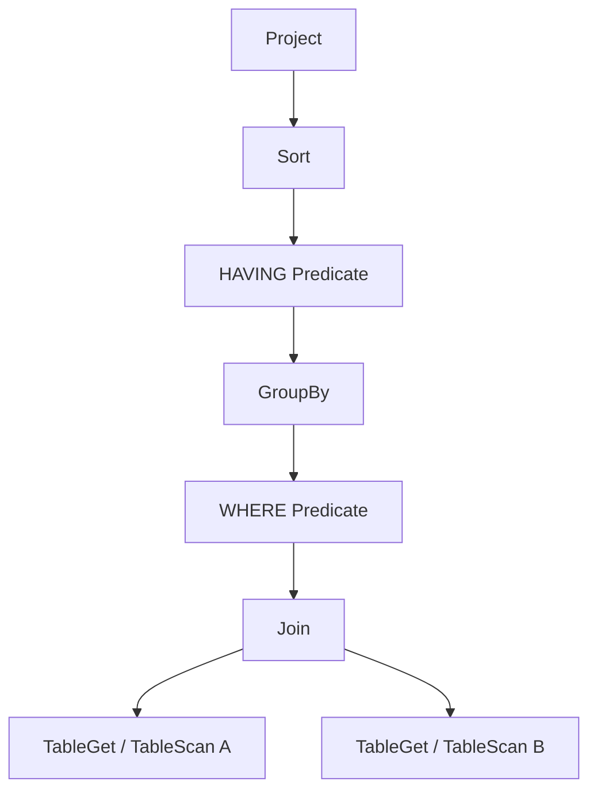
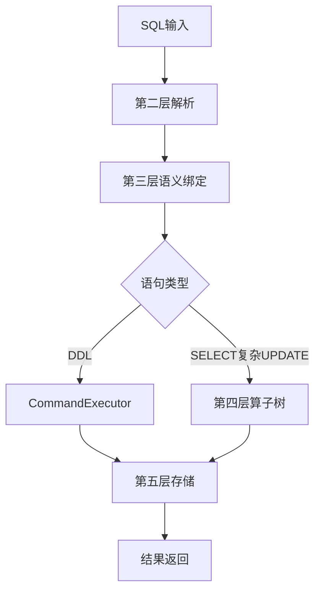

# 基于 MiniOB 的数据库管理系统设计与实现

本报告介绍北京邮电大学《数据库系统原理》课程设计在 MiniOB 教学内核上的扩展工作。全文按「课题背景 → 整体设计 → 具体设计与实现 → 测试与分析 → 总结」组织：前两章说明任务与架构，第三章展开各功能域的实现细节（全文主体），后两章给出测试依据与结论。

---

## 1. 课题背景与任务说明

### 1.1 课题来源与任务边界

本课程设计基于 MiniOB 完成数据库管理系统内核的功能扩展。MiniOB 由 OceanBase 社区与多所高校联合维护，代码规模适中、模块分层清晰，适合作为数据库系统原理课程的实践平台。指导书要求学生在 Linux 或 Docker 等环境下，使用 C/C++、Lex、Yacc 等工具，理解 SQL 从文本输入到存储引擎访问的完整路径，并在 Parser、语义绑定、执行计划、物理算子与存储层完成题目所列扩展。

课程设计并非要求从零实现商业级数据库，而是在既有框架上补全 SQL 能力，并通过编译、运行与测试验证行为正确性。本课题的任务边界因此可以概括为两点：其一，在 MiniOB 主链上正确落地指导书要求的 SQL 语义；其二，建立可重复执行的测试与演示手段，使实现结果可核查、可答辩展示。指导书第三章共列出 25 道题目，正文仅标注难度等级；课程验收所用的分项分值见指导书末尾「实验验收表格」，本报告完成情况与测试结论以仓库代码及 `lab/test/latest.md` 为准。

### 1.2 MiniOB 与 SQL 执行主链（背景说明）

从背景角度理解 MiniOB，需要抓住一条贯穿始终的执行主链。客户端（CLI、`obclient` 等终端方式）将 SQL 文本送入 observer；网络与会话层接收请求后，词法语法分析模块（`lex_sql.l`、`yacc_sql.y`）把输入转为语法树或表达式节点；语义绑定层（各类 `Stmt` 与 `ExpressionBinder`）完成表名、字段名、类型与子查询作用域解析；查询类语句再进入逻辑计划与物理计划生成，由 TableScan、Predicate、Join、GroupBy、Sort、Project、Update 等算子按火山模型执行；最终由事务接口调用堆表引擎与 B+ 树索引完成读写。

需要特别区分的是 DDL 与查询类 DML 的路径差异。`DROP TABLE` 等 DDL 在语义绑定后进入 `CommandExecutor`，直接操作 catalog 与磁盘文件，不经过完整查询算子树；`SELECT` 以及带复杂 WHERE、子查询的 `UPDATE` 则全程算子化执行。本课题后续所有功能扩展，都建立在对这条主链的分层理解之上：先判断改动应落在哪一层，再在该层做最小必要扩展，避免旁路实现。

### 1.3 功能范围与完成情况

指导书 25 道题目涵盖 DDL/DML、类型与表达式、查询与聚合、索引、NULL 语义、子查询及大规模读写验证等能力。本系统已实现其中 **18 道**，包括 `complex-sub-query`、`big-query`、`big-write` 等困难题；尚未实现的题目为 alias、text、create-view、create-table-select、update-mvcc、big-order-by，本报告对已实现部分展开设计与实现说明，对未完成题目不作展开。

**表 1-1 指导书题目完成情况（与指导书顺序一致）**

| 题号 | 题目 | 难度 | 实现状态 |
|------|------|------|----------|
| 1 | basic | 简单 | 已实现 |
| 2 | date | 简单 | 已实现 |
| 3 | drop-table | 简单 | 已实现 |
| 4 | update | 简单 | 已实现 |
| 5 | aggregation-func | 简单 | 已实现 |
| 6 | like | 简单 | 已实现 |
| 7 | join-tables | 中等 | 已实现 |
| 8 | simple-sub-query | 中等 | 已实现 |
| 9 | function | 中等 | 已实现 |
| 10 | multi-index | 中等 | 已实现 |
| 11 | unique | 中等 | 已实现 |
| 12 | null | 中等 | 已实现 |
| 13 | update-select | 中等 | 已实现 |
| 14 | expression | 中等 | 已实现 |
| 15 | alias | 中等 | 未实现 |
| 16 | text | 中等 | 未实现 |
| 17 | order-by | 中等 | 已实现 |
| 18 | group-by | 中等 | 已实现 |
| 19 | create-view | 中等 | 未实现 |
| 20 | create-table-select | 中等 | 未实现 |
| 21 | complex-sub-query | 困难 | 已实现 |
| 22 | update-mvcc | 困难 | 未实现 |
| 23 | big-query | 困难 | 已实现 |
| 24 | big-write | 困难 | 已实现 |
| 25 | big-order-by | 困难 | 未实现 |

说明：指导书中 function（§1.9）与 expression（§1.14）为两题，本系统通过统一表达式体系统一实现；官方与自定义测试分别覆盖相关场景。

从能力类型归纳，已实现部分包括：基线与 DDL/DML（basic、drop-table、update）；类型与查询（date、aggregation、like、join、order-by、group-by、function、expression）；索引（multi-index、unique）；语义扩展（null、simple/complex sub-query、update-select）；稳健性验证（big-query、big-write）。课程中期要求完成不少于全部内容 50% 的进度，当前实现范围已满足课程进度要求。

### 1.4 开发与验证环境

MiniOB 面向 Linux/macOS 工具链编译，依赖 CMake、Flex、Bison 3.x 及 C++ 编译器。本课题在 macOS 本机完成主力开发与全量自动化回归；Windows 侧通过 Docker Desktop 将仓库挂载至容器内 `/miniob` 进行编译与答辩演示，内核源码与测试资产共用同一 Git 仓库。环境差异仅体现在编译运行载体，不影响设计说明与测试结论的引用。

除内核外，本课题在 `lab/frontend/` 增加浏览器验收界面，在 `lab/test/` 建立官方用例、自定义 SQL、综合断言与压力脚本四层回归体系。验证工作以 `python3 lab/test/run_all.py` 生成的 `lab/test/latest.md` 为主要依据；答辩演示可通过 `node lab/frontend/server.js` 启动前端，经 TCP 6789 与 observer 通信。

---

## 2. 系统整体设计

### 2.1 五层架构

本系统将扩展后的处理流程归纳为五层架构，如图 2-1 所示。该图自上而下描述 SQL 从用户输入到结果返回的完整路径；左侧标注了 NULL、简单子查询、UPDATE SELECT、Big Query 等典型功能在各层上的落点，用于说明功能扩展应落在哪一层、层与层之间如何衔接。


**第一层（接口与展示层）** 负责接收 SQL、展示执行结果，不参与语法解析与存储访问。除 MiniOB 自带的 CLI 与 `obclient` 外，本课题增加 `lab/frontend/` 浏览器验收界面：主页提供 18 个已实现功能的一键演示、现场 SQL 控制台与推荐脚本；`/tests.html` 汇总 135 条自动化回归结果，便于答辩展示与书面报告交叉核对。

**第二层（SQL 解析层）** 对应 SQL 编译前端中的“词法分析 + 语法分析”。`lex_sql.l` 先把字符流切分为关键字、标识符、常量等 token，`yacc_sql.y` 再按产生式归约为 `ParsedSqlNode`、`SelectSqlNode`、表达式节点等语法结构。本层回答的是“这条 SQL 在语法上是否合法”；本课题在此层扩展了 NULL、IN、GROUP BY、UNIQUE INDEX 等关键字与产生式，并将 SELECT 的 WHERE 从条件链改造为表达式树。

**第三层（语义分析与语句对象层）** 对应编译阶段中的“名字解析与语义检查”。`SelectStmt`、`UpdateStmt` 与 `ExpressionBinder` 在这一层完成表名、字段名、类型匹配、聚合上下文与子查询作用域解析，把语法结构转化为可执行的语句对象。该层回答的是“这条 SQL 虽然能解析，但它引用的表、列、类型与作用域是否真正成立”。

**第四层（优化与执行计划层）** 先生成逻辑计划，再生成物理计划。逻辑计划回答“需要哪些算子、执行顺序如何”，物理计划回答“每个算子具体如何执行、采用哪种访问路径”。在 SELECT 类语句中，算子树通常以 Project 为根，以 TableGet/Scan 为叶，Predicate、Join、GroupBy、Sort 等位于中间层；物理执行阶段则把这些节点实例化为 `TableScanPhysicalOperator`、`IndexScanPhysicalOperator`、`NestedLoopJoinPhysicalOperator`、`SortPhysicalOperator` 等具体对象，并按火山模型 `open → next → close` 协作。

**第五层（存储与数据管理层）** 管理堆表记录、null bitmap、B+ 树索引、缓冲池与磁盘页，保证 DML 与索引同步及持久化。需要特别指出的是：逻辑计划和物理计划对象本身都驻留在内存中，但真实数据仍由堆表页、索引页与缓冲池负责保存和调度；物理计划只是以迭代器方式驱动这些底层结构按需返回 tuple，而不是把整张表装入计划树对象。

### 2.2 从编译原理视角理解 SQL 主链

若从编译原理课程的视角观察 MiniOB，可以把一条查询语句理解为“SQL 文本经过多阶段转换，最终被执行器解释执行”的过程。与传统编译器相比，MiniOB 在语义分析之后并不生成机器码，而是生成逻辑算子树和物理算子树，再由执行器按需拉取元组。这个视角有助于解释为什么同一个功能有时要同时修改 Parser、Binder 和 Operator：它们分别处在不同的转换阶段。

**表 2-1 SQL 主链与编译流程对应关系**

| 阶段 | MiniOB 对应模块 | 主要输出 | 关注问题 |
|------|------------------|----------|----------|
| 词法分析 | `lex_sql.l` | token 序列 | 字符流如何切分为关键字、标识符、常量 |
| 语法分析 | `yacc_sql.y` | `ParsedSqlNode` / AST 风格结构 | 语句结构是否合法、从句是否完整 |
| 语义绑定 | `Stmt::create_stmt`、`ExpressionBinder` | `SelectStmt`、`UpdateStmt`、已绑定表达式 | 表列解析、类型检查、聚合上下文、子查询作用域 |
| 逻辑计划生成 | `LogicalPlanGenerator` | 逻辑算子树 | 需要哪些算子、先后顺序如何 |
| 物理计划生成 | `PhysicalPlanGenerator` | 物理算子树 | 扫描/连接/聚合算子采用何种具体实现 |
| 执行调度 | `ExecuteStage` + 物理算子 | 查询结果或影响行数 | 如何按 `open/next/close` 产出结果 |
| 存储访问 | `Table`、`RecordManager`、`BplusTreeIndex` | 记录、索引项、页访问 | 数据最终从何处读写、如何持久化 |

图 2-2 以“SQL 文本 → Token → AST → Stmt → Logical Plan → Physical Plan → Result”的纵向转换链展示了主执行链，使读者从一开始就能把第 3 章各功能改动定位到具体阶段。


### 2.3 逻辑计划、物理计划与火山模型

逻辑计划与物理计划是本系统最值得展开说明的两个层次。逻辑计划是“做什么”的描述，它不直接关心记录如何被取出，而强调算子的组合关系；物理计划是“怎么做”的描述，它把逻辑算子落成具体执行对象，并选择访问路径与执行模型。对课程设计报告而言，把这两个层次区分清楚，能够自然解释 join、group-by、order-by、update-select 等题目为何最终都落在统一的算子框架里。

**表 2-2 逻辑计划与物理计划对比**

| 对比项 | 逻辑计划 | 物理计划 |
|--------|----------|----------|
| 核心问题 | 需要哪些算子、顺序如何 | 每个算子如何执行、访问路径如何选择 |
| 典型节点 | `TableGet`、`Predicate`、`Join`、`GroupBy`、`Sort`、`Project` | `TableScan`、`IndexScan`、`NestedLoopJoin`、`GroupByPhysicalOperator`、`SortPhysicalOperator`、`ProjectPhysicalOperator` |
| 是否包含执行细节 | 不直接体现扫描器、缓存、逐行迭代细节 | 明确 `open/next/close` 生命周期与子算子调用关系 |
| 是否直接访问存储层 | 否 | 是，按需向表扫描器、索引扫描器请求记录 |
| 生命周期 | 优化阶段生成 | 执行阶段持有并驱动 |

以 `SELECT name FROM student WHERE score > 60 ORDER BY name` 为例，逻辑计划可抽象为 `TableGet → Predicate → Sort → Project`；物理计划则会进一步决定底层是走 `TableScan` 还是 `IndexScan`，并把这些节点实例化为真实对象。若查询包含 JOIN，则逻辑计划的叶子通常是多个表访问节点，中间层是 Join 与 Predicate，根节点仍是 Project；若从表达式树视角观察，叶子则是 `FieldExpr` 和 `ValueExpr`。两类“树”在报告中宜明确区分，避免把表达式树与算子树混为一谈。




火山模型体现为一种“父算子逐条向子算子取数据”的迭代方式。`open` 阶段递归打开子算子，初始化记录扫描器、子查询状态或临时缓冲；`next` 阶段由父算子不断向下游请求下一条 tuple，并在本层完成过滤、投影、连接或聚合；`close` 阶段递归释放扫描器、结果缓存与表达式相关资源。`TableScanPhysicalOperator::open` 会向 `Table` 申请 record scanner，随后在 `next` 中逐条读取 record；`PredicatePhysicalOperator` 则先打开子算子，再对 `current_tuple` 求值过滤；`ProjectPhysicalOperator` 自身不生成新记录，而是对下层 tuple 做表达式投影。


从实际代码路径看，`OptimizeStage` 的主线并不是复杂代价优化器，而是“逻辑计划生成 → 规则重写 → 物理计划生成”。也就是说，系统会先调用 `LogicalPlanGenerator` 产生逻辑算子树，再由 rewriter 反复执行表达式简化、谓词重写等规则，最后通过 `PhysicalPlanGenerator` 落成 tuple iterator 物理算子。仓库中确实保留了 cascade 优化框架，但它不构成当前 18 道题实现的主路径，因此本报告将重点放在规则重写与算子实例化上。

这里还需要澄清一个常见误解：物理计划“物理”并不意味着把数据保存在计划树里，更不意味着 MiniOB 变成纯内存数据库。更准确的说法是，物理算子对象本身存在内存中，负责调度执行顺序；数据是否命中缓冲池、是否访问表文件或索引文件，则由第五层存储模块决定。因此，报告在描述物理计划时，应强调“执行方式”和“访问路径”两个关键词，而不是简单理解为“磁盘上的计划”。

图 2-3 与图 2-4 可分别用于展示“同一 SELECT 的逻辑/物理计划对照”与“`open → next → close` 的拉取式执行时序”，它们比单张总体架构图更能体现数据库内核的执行细节。

### 2.4 执行主链与 DDL/DML 路径分叉

在上述转换链中，真正发生路径分叉的位置位于语义绑定之后。DDL（如 `DROP TABLE`、`CREATE INDEX`）经 `CommandExecutor` 进入 `Db`/`Table` 元数据与文件操作，不实例化 TableScan、Join 等查询算子。`SELECT` 与带表达式 WHERE、子查询 SET 的 `UPDATE` 则必须走第四层算子树：先由逻辑计划确定算子种类与顺序，再由物理计划实例化具体算子，最终在第五层读写记录与索引。

这样分叉的意义在于避免把 DDL 与查询混写一套执行逻辑。若将 `DROP TABLE` 误放入查询算子链，既增加计划生成复杂度，也与 catalog 操作的语义不符。本课题在整体设计阶段即明确这一边界，后续 drop-table 与 update 的实现分别沿两条路径展开（见 §3.1）。



### 2.5 模块职责与分层原则

整体设计遵循四条分层原则，以保证扩展与 MiniOB 原有框架一致。

**原则一：语法扩展只造结构。** Parser 层只识别「能否按语法读入」，不校验表是否存在、类型是否匹配。语义校验统一放在 Stmt 与 Binder 层。

**原则二：查询走算子链。** SELECT 类能力及复杂 UPDATE 在第四层闭合，不在 `CommandExecutor` 中手写扫表循环。

**原则三：表达式尽量复用。** 函数、LIKE、NULL 比较、子查询统一抽象为 `Expression`，供 WHERE、HAVING、UPDATE SET 共用，避免为 update-select 单独实现一套子查询执行逻辑。

**原则四：DML 与索引同步。** 第五层在 INSERT/UPDATE/DELETE 时维护全部相关索引；失败时按步骤回滚，避免堆表与 B+ 树不一致。big-write 压力测试会把这一原则放大到数百次混合写场景下检验。

各层与主要源码目录的对应关系为：展示层 `lab/frontend/`；解析层 `src/observer/sql/parser/`；绑定层 `src/observer/sql/stmt/`、`expression_binder.cpp`；计划层 `src/observer/sql/optimizer/`、`src/observer/sql/operator/`；存储层 `src/observer/storage/table/`、`storage/index/`。

### 2.6 跨层复用关系

后期题目难度上升，往往不是在某个孤立文件里「再写一个功能」，而是在已有模块上延伸。本系统有四条主要复用链路，对应架构图左侧的功能标注。

**表达式系统**：function、like、null 比较、子查询标量/IN 比较，最终都通过 `Expression::get_value` 与 `ComparisonExpr::compare_value` 求值。WHERE、HAVING、Project 共用同一套表达式树。

**子查询设施**：`SubQueryExpr`、`InSubQueryExpr` 同时服务 SELECT WHERE（simple/complex sub-query）与 UPDATE SET（update-select）。Binder 递归构造内层 `SelectStmt`；执行层区分可缓存的非关联子查询与须逐行重算的关联子查询。

**索引维护**：multi-index 扩展键编码与比较；unique 在插入前查重；update 与 delete 路径要求先删旧索引项、改记录、再插新项，失败则回滚。该链路贯穿 §3.1 与 §3.2。

**NULL 语义**：从 `FieldMeta::nullable_`（schema）到 record null bitmap（存储），再到比较表达式与聚合器跳过 NULL（执行）。架构图功能 1 标示了该能力在第二至第五层的落点，§3.4 展开具体实现。

---

## 3. 系统具体设计与实现

本章在 §2 五层架构基础上，按功能域说明各层具体改动、处理流程与关键代码。实现均沿执行主链完成，不采用旁路脚本直接操作存储。各节实现描述对照图 2-1 相应层次。

### 3.1 DDL 与基础 DML

#### 问题与落层

drop-table 与 update 是早期 DDL/DML 扩展的基础题目。改前 MiniOB 对 `DROP TABLE` 已有语法节点但缺少 `Db::drop_table` 执行路径；`UPDATE` 则在 Stmt 层为空实现，存储层 `update_record_with_trx` 返回不支持。drop-table 属于 catalog 操作，应落在第三层以下 CommandExecutor 路径；update 与 DELETE 类似，应走第四层算子链并在第五层维护索引。

#### drop-table 实现流程

`DROP TABLE t` 的处理流程为：第二层 `yacc_sql.y` 产生 `SCF_DROP_TABLE` → 第三层 `Stmt::create_stmt` 构造 `DropTableStmt` → `CommandExecutor` 调用 `Db::drop_table` → 删除表元数据、数据文件与关联索引文件 → 返回 SUCCESS 或 FAILURE。删除不存在的表应返回失败；删除后允许同名 `CREATE TABLE`，以验证 catalog 与磁盘状态已彻底清理。

这样设计与 `CREATE TABLE` 对称，集中由 catalog 层管理表对象生命周期，避免在存储引擎内散落「删文件」逻辑。官方 `primary-drop-table.test` 与自定义 `drop-table.sql` 覆盖有数据表、带索引表及删不存在表等场景。

#### update 实现流程

`UPDATE` 的改前状态是：语法节点 `SCF_UPDATE` 已存在，但 `UpdateStmt::create` 返回内部错误，逻辑/物理计划无 UPDATE 算子，引擎层不支持原地更新。本系统补齐的链路为：第二层解析 `UPDATE … SET … WHERE …` → 第三层 `UpdateStmt` 绑定目标表、更新列与 WHERE 条件 → 第四层 TableScan + Predicate + `UpdatePhysicalOperator` → 第五层 `HeapTableEngine::update_record_with_trx`。

存储层对含索引表的更新采用「删旧索引项 → 修改 record → 插新索引项」顺序；任一步失败则回滚已完成的索引操作，避免堆表与 B+ 树分叉。指导书提示可参考 delete 再 insert；本实现选择原地改记录并同步索引，与 `RecordFileHandler` 的访问模式一致，且减少记录搬移开销。

UPDATE 算子对每条命中行先缓存旧记录再写回，是为了避免边扫描边修改导致漏扫或重复扫描；中途失败时按旧记录回滚已更新行，保证语句级一致性。带索引列更新场景由 `lab/test/cases/sql/update-index.sql` 与官方 `primary-update.test` 验证。

### 3.2 存储层与索引设计

#### 问题与落层

multi-index 与 unique 题目主要考察 B+ 树层的键编码与约束语义；big-write 等压力题则把索引维护的正确性放到长时间混合写背景下检验。相关改动集中在第五层 `IndexMeta`、`BplusTreeIndex` 与 `HeapTableEngine` 的 DML 路径，第二层仅扩展 `CREATE INDEX` 语法（含 `UNIQUE` 与多列列表）。

#### 复合索引（multi-index）

复合索引在 `IndexMeta` 中保存字段 ID 列表，建索引时按列定义顺序将多列值编码为组合键，B+ 树比较器按字典序比较。难点不在于 `CREATE INDEX idx ON t(c1,c2)` 语法本身，而在于 INSERT/UPDATE/DELETE 是否对**每一**复合索引执行插入或删除。本系统在每条 DML 路径上遍历表关联的全部索引并维护键值，与堆表写入处于同一逻辑边界。

若只改元数据与建索引逻辑而遗漏 DML 维护，会出现「查询走索引结果错误、全表扫描仍正确」的隐蔽缺陷。因此 multi-index 开发与后续 update、big-write 加固一并回归。

#### 唯一索引（unique）

唯一索引在 `IndexMeta` 中增加 `unique_` 标志并持久化。`BplusTreeIndex::insert_entry` 在 unique 索引上插入前先 `get_entry` 查重，发现重复键则返回 FAILURE。非 unique 索引仍以「列值 + RID」作为 B+ 树键，允许多行具有相同索引列值。

重复插入、对已有重复数据建唯一索引等场景在测试中作为 EXPECTED FAILURE 保留，用于验证约束生效而非程序崩溃。官方 `primary-unique.test` 与自定义 `unique.sql`（含行数断言）覆盖该能力。

#### DML 与索引一致性（含 DELETE 加固）

UPDATE 更新索引列时，存储层顺序为：删旧索引项 → 改 record → 插新索引项。DELETE 路径曾存在「索引已删、记录仍在」的半一致风险；本系统已按与 UPDATE 对称的顺序加固：先 `delete_entry_of_indexes`，再 `delete_record`，若删记录失败则 `insert_entry_of_indexes` 回滚索引。

big-write 压力脚本（500 次混合写含重启校验）会把这一路径放大检验。最终以 `count(*)` 与重启后点查验证堆表与索引一致。该设计与 §3.8 大规模读写验证直接相关。


### 3.3 类型、表达式与查询实现

#### 问题与落层

date、aggregation-func、like、function、expression、join-tables、order-by、group-by 等题目共同依赖统一的表达式体系与算子拼装，主要落在第二层（语法）、第三层（绑定）、第四层（算子执行）。本系统未为每题单独写一套执行分支，而是在 Parser 与 Binder 扩展后，由计划生成器插入相应物理算子。

从算子树角度看，这一类题目虽然表面语法不同，但最终都要归并为 `Scan → Predicate → Join → GroupBy → HAVING → Sort → Project` 的某种子序列。也就是说，系统实现的关键不在于“某个关键字有没有被识别”，而在于识别之后能否被正确挂接到统一计划树上。图 3-1 适合用一个带 WHERE、GROUP BY、HAVING、ORDER BY 的 SELECT 示例，展示查询文本如何被映射为算子树。

#### DATE 类型

DATE 在 SQL 层以字符串形式出现，内部编码为整数以便比较与索引；插入阶段由 `DateType` 校验年月日合法性（含闰年规则），非法日期返回 FAILURE。索引键比较复用数值序，使 DATE 字段建索引后点查与范围过滤与全表扫描语义一致。官方 `primary-date.test` 覆盖非法日期与索引场景。

#### 聚合、GROUP BY 与 HAVING

聚合函数通过 `Aggregator` 在 GroupBy 算子中累积 `COUNT/MIN/MAX/AVG/SUM` 状态。计划顺序必须为 `Scan → WHERE → GroupBy → HAVING → Sort → Project`：HAVING 过滤的是聚合后的分组结果，不能提前到 WHERE 位置，否则语义与 SQL 标准不符。

`GROUP BY` 支持多列分组；`HAVING` 条件可引用聚合表达式。官方与自定义用例包含 HAVING 断言（如 `avg(score) > 2`），验证聚合后再过滤的行集正确。

#### LIKE、函数与算术表达式

`LIKE` 作为比较运算接入 `ComparisonExpr`，在 `like_match` 中实现 `%` 与 `_` 语义；函数（length、round、date_format）与算术表达式在 Binder 阶段校验参数类型与个数，在 Predicate 或 Project 阶段 `get_value` 求值。expression 与 function 在指导书中为两题，本系统共用 `Expression` 层次统一实现。

#### JOIN 与 ORDER BY

多表 INNER JOIN 采用 `NestedLoopJoinPhysicalOperator`：外层遍历左表，内层扫描右表，在组合 tuple 上对 ON 条件求值。链式 JOIN 与「JOIN + WHERE」在计划生成阶段拼成算子树。ORDER BY 由 `SortPhysicalOperator` 在子算子输出之上做内存排序，支持多列 ASC/DESC；与 GROUP BY 组合时 Sort 位于 GroupBy 之后、Project 之前。

### 3.4 NULL 语义实现

#### 问题与落层

NULL 题目表面是语法扩展，实际贯穿元数据、记录存储、表达式比较与聚合执行，对应架构图功能 1 在第二至第五层的标注。改前 MiniOB 无法用位图持久化「列缺失」，也无法正确处理 `IS NULL` 与普通比较的差异。本系统采用 row record null bitmap 方案：每条记录在用户字段 payload 前附带位图，schema 级 `nullable` 与行级空值状态分离。

#### Schema 与记录布局

`CREATE TABLE` 时字段定义中的 `NULL`/`NOT NULL` 写入 `FieldMeta::nullable_` 并持久化到表元数据。记录布局调整为 `[系统事务字段][null bitmap][用户字段 payloads]`。插入或更新时，若向 NOT NULL 列写入 NULL，`Table::make_record` 等路径应返回失败，而不是留到存储层再暴露错误。

**表 3-1 NULL 支持后的单条记录逻辑布局**

| 区段 | 内容 | 作用 |
|------|------|------|
| 系统事务字段 | 事务可见性、删除标记等内部信息 | 供事务与记录管理模块使用 |
| null bitmap | 每一位对应一个逻辑字段是否为 NULL | 持久化空值状态，重启后不丢失 |
| 用户字段 payloads | 各列的真实编码值 | 存储业务数据本身 |

这一定义说明：schema 级的 `nullable` 只描述“该列允不允许为空”，而行级的 null bitmap 才描述“这一行这一列当前是否为空”。图 3-2 适合把这两层语义同时画出来，帮助读者区分列约束与记录状态。


#### 位图读写

位图读写的核心逻辑在 `TableMeta::field_is_null` 与 `set_field_null`：

```cpp
bool TableMeta::field_is_null(const char *record, int field_id) const
{
  const unsigned char *bitmap =
      reinterpret_cast<const unsigned char *>(record + null_bitmap_offset_);
  return (bitmap[field_id / 8] & (1 << (field_id % 8))) != 0;
}
```

输入为已定位到用户记录区的 `record` 指针与逻辑字段 ID；关键逻辑是按字节内位偏移判断该列是否为空；这样设计的原因是用固定位图持久化空值状态，重启后语义不丢失，且不必用 0 或空串冒充 NULL。

#### 比较与聚合

比较表达式对 NULL 的处理与位图读取衔接。`IS NULL`/`IS NOT NULL` 直接根据 `Value::is_null()` 判断；普通比较在任一侧为 NULL 时返回 false，不命中 WHERE：

```cpp
default: {
  if (left.is_null() || right.is_null()) {
    result = false;
    return RC::SUCCESS;
  }
  // ... 常规 compare
}
```

输入为已绑定好的左右 `Value`；关键逻辑是把 unknown 语义落实为过滤失败；这样设计与指导书「NULL 与任何数值比较结果为 false」一致，且与 `IS NULL` 专用运算符区分。聚合函数在累积阶段跳过 NULL，避免 AVG 等把缺失值当作 0。官方 `primary-null.test` 与自定义 `null.sql` 主要验证 schema 约束、位图存储、比较表达式与聚合行为四个方面。

### 3.5 简单子查询实现

#### 问题与落层

简单子查询要求支持 `IN (SELECT …)`、标量子查询比较等，且子查询与外层查询不关联。改前 WHERE 使用 `ConditionSqlNode` 链，无法表达内层独立 SELECT。本系统将 SELECT 的 WHERE 切换为表达式链，在第二层构造 `InSubQueryExpr` 或标量子查询节点；第三层绑定内层 `SelectStmt`；第四层 materialize 子查询结果并做成员或标量判断。对应架构图功能 2。

#### 绑定阶段

子查询绑定的核心逻辑在 `bind_subquery_expression`：对内层 SELECT 递归调用 `SelectStmt::create`，并约束输出必须为单列且非 `SELECT *`：

```cpp
RC rc = SelectStmt::create(db_, unbound_expr->select_sql(), stmt, &context_);
// ...
if (select_stmt->query_expressions().size() != 1) {
  return RC::INVALID_ARGUMENT;
}
if (value_expr->type() == ExprType::STAR) {
  return RC::INVALID_ARGUMENT;
}
bound_expressions.emplace_back(
    make_unique<SubQueryExpr>(std::move(select_stmt), std::move(value_expr_copy)));
```

输入为 Parser 产生的未绑定子查询表达式与当前 Binder 上下文；关键逻辑是递归构造内层语句并校验单列输出；这样设计的原因是把子查询统一为 `SubQueryExpr`，供 IN 与标量比较复用，且把非法子查询（多列、星号）拦截在绑定阶段。非关联子查询标记为非 correlated，执行时可 materialize 一次后复用结果集。

#### 执行阶段

`InSubQueryExpr` 在 Predicate 算子求值前 prepare 内层物理计划，open 后收集结果集，再判断外层表达式是否满足 IN 或标量比较。标量比较要求子查询最多返回一行，多行时 FAILURE。NOT IN 在子查询结果含 NULL 时的语义按官方用例约定处理。官方 `primary-simple-sub-query.test` 与自定义 `simple-sub-query.sql` 覆盖上述场景。

### 3.6 复杂子查询（关联子查询）实现

#### 问题与落层

复杂子查询在简单子查询基础上要求内层引用外层当前行，即关联子查询；单独执行内层 SELECT 应报错。本质是作用域问题：内层字段解析不到时，须沿 `BinderContext` 父链查找外层表，标记 `FieldExpr::outer_ref_`。执行时子查询结果依赖外层当前行，不能全局缓存 materialize 结果。对应架构图 simple-sub-query 的延伸，主要在第三、四层。

#### 绑定与 outer_ref

关联子查询绑定时，若字段不属于内层 FROM 表，Binder 沿父作用域查找外层表字段，设置 `outer_ref_` 为 true。`SubQueryExpr` 根据内层是否含外层引用标记 `correlated_`；correlated 子查询在对外层每一行求值时须重新执行内层计划，并用 outer tuple 提供外层列值。

嵌套关联子查询执行时，外层 tuple 栈仅在栈空时 push，避免内层 scan tuple 覆盖主查询当前行。该细节用于防止多层嵌套时读错外层列。

#### 与简单子查询的差异

非关联子查询结果只依赖内层表，materialize 后可缓存；关联子查询必须对外层每一行重新执行。单独执行 `SELECT … WHERE … IN (SELECT … WHERE inner.a = outer.a)` 中的内层子查询而不带外层上下文时，应返回失败，因为 `outer.a` 无绑定对象。官方 `primary-complex-sub-query.test` 与自定义 `complex-sub-query.sql` 验证嵌套非关联、一层关联及聚合+关联组合场景。

从报告表达上看，复杂子查询最容易让读者混淆“绑定期发现 outer reference”与“执行期逐行重算”这两个动作。图 3-3 适合分成左右两部分：左侧画 Binder 沿父作用域查找字段并设置 `outer_ref_`，右侧画执行器在每条外层 tuple 上重新 `open/next/close` 内层子查询。


### 3.7 update-select 实现

#### 问题与落层

update-select 要求 `UPDATE t SET c = (SELECT …)`，SET 右值可为子查询或表达式，对应架构图功能 3。若在 UPDATE 算子内单独实现子查询，将与 SELECT WHERE 重复且难以维护。本系统将 SET 右值绑定为通用 `Expression`，复用 §3.5、§3.6 的子查询设施；第四层 `UpdatePhysicalOperator` 对每条命中行调用 `value_expr_->get_value(row_tuple, value)` 求值后写回。

#### 逐行求值与回滚

处理流程为：第二层扩展 `UPDATE ID SET ID EQ expression` 产生式 → 第三层 `UpdateStmt` 绑定 SET 右值（可含 `SubQueryExpr`）→ 第四层扫描命中行，以当前行 tuple 为上下文求 SET 值 → 第五层写回并维护索引。关联子查询通过 outer tuple 传入当前更新行，求值路径与 SELECT WHERE 中关联过滤一致。

若 SET 子查询返回多行却参与标量赋值，应 FAILURE；中途写回失败时按已修改行回滚。官方无单独 primary 文件时，由自定义 `update-select.sql` 与综合断言用例覆盖。这样设计之后，UPDATE 模块只消费表达式接口，不必感知子查询内部执行细节。

这一节与 §3.5、§3.6 的联系较强，适合补一张“Expression 复用链路图”：同一个 `SubQueryExpr` 同时服务 WHERE 与 UPDATE SET，只是外层上下文不同。图 3-4 可据此设计，突出“表达式复用而非为 UPDATE 单独写子查询执行器”的实现思路。


### 3.8 大规模读写验证

#### 问题与落层

big-query 与 big-write 不新增 SQL 语法，用于验证第四层多算子串联与第五层存储在规模放大后是否仍正确，对应架构图功能 4。前期单题正确并不必然保证多模块串联后稳定；压力测试把 DELETE 索引回滚、缓冲池访问与计划执行频次一并放大。

#### big-query

压力脚本 `gen_big_query_sql.py` 构造主表 800 行与维表 20 行（固定随机种子），串联索引点查、GROUP BY、HAVING、IN 子查询、JOIN、ORDER BY 等路径，最终以 `SELECT count(*) FROM bq_main` 期望 800 校验。该题验证的是已实现查询能力在组合后的正确性，而非单一语法点。

#### big-write

脚本 `gen_big_write_sql.py` 使用固定种子生成大量 INSERT、UPDATE、DELETE 混合操作；500 行场景校验 `count(*)=420` 并重启 observer 验证持久化；2000 行场景校验 `count(*)=1680`。存储层 DELETE 与 UPDATE 的索引回滚策略（§3.2）是能否通过该题的关键。两题共同说明：本系统不仅实现语法点，还保证 DML 与索引在长时间写入下的一致。

### 3.9 浏览器验收展示前端

#### 问题与落层

内核正确性需可演示、可核查。CLI 与 `obclient` 适合开发调试，但不利于答辩时按题展示、对照测试报告。本系统在 `lab/frontend/` 增加浏览器验收界面，位于架构图第一层，不参与 SQL 解析；其职责是把预设或手写的 SQL 通过 Node.js 代理转发给 observer，并把返回结果以可视化方式呈现在页面上。

#### 界面与功能

前端采用深色面板风格，主页分为三个区域：**功能演示按钮区**（18 个已实现题目各对应一组 `demo_*` 表 SQL）、**现场 SQL 控制台**（支持分号分隔的多语句输入与推荐脚本一键加载）、**输出控制台**（逐条显示 SUCCESS/FAILURE 与查询结果）。右上角提供「测试总览」入口，跳转至 `/tests.html` 查看全量回归汇总。


*图 3-6 验收展示前端主页：功能按钮、推荐脚本与输出控制台*

点击功能按钮后，页面按 `demos.js` 中预设 SQL 逐条执行，结果实时追加到下方控制台。以 basic 为例，演示流程覆盖建表、插入与查询，便于老师现场核对 DDL/DML 行为。


*图 3-7 功能演示：basic 建表 / 插入 / 查询*

现场 SQL 控制台支持答辩时临时输入语句，推荐脚本覆盖 NULL 语义、UNIQUE 约束、UPDATE + 子查询等代表性场景；执行结果同步写入 `session.log`，可通过「导出日志」按钮下载归档。


*图 3-8 现场 SQL 控制台与推荐脚本*

#### 协议与代理

`server.js` 通过 HTTP `POST /api/sql` 接收 SQL 列表，经 TCP 连接 observer，按 plain 协议发送 `<sql>\0`、读取 `<output>\0` 响应，与 `obclient.cpp` 行为一致。启动时优先探测 `tcp://127.0.0.1:6789`：若 observer 已在运行则直接复用；否则自动拉起专供 demo 的 observer，工作目录隔离为 `lab/frontend/runtime/observer-data`，避免与开发/回归数据目录混用。

对删不存在表、唯一冲突、多行标量子查询等故意失败场景，页面标注 **EXPECTED FAILURE**，日志中以 `EXPF` 区分，避免误判为回归缺陷。`big-query` / `big-write` 等长脚本默认超时放宽至 20s，避免展示阶段被代理过早中断。

#### 测试总览页

`/tests.html` 经只读接口 `/api/test-report` 汇总 `lab/test/latest.json`、`latest.md` 及功能展示说明，展示 135 条用例通过率、官方/自定义/压力三类覆盖、按 feature 汇总矩阵与慢用例列表，与 §4 书面测试结论使用同一数据源。


*图 3-9 测试总览页：全量回归结果汇总（135/135 通过）*


*图 3-10 测试总览页：分类覆盖与功能矩阵*

#### 启动方式

在仓库根目录执行：

```bash
node lab/frontend/server.js
# 浏览器打开 http://127.0.0.1:3001
# 测试总览 http://127.0.0.1:3001/tests.html
```

重跑同一演示按钮前应先点「重置 demo 数据」，避免 `demo_*` 表已存在导致 INSERT 重复。启动方式为 `node lab/frontend/server.js`，浏览器访问 `http://127.0.0.1:3001`。

---

## 4. 系统测试与结果分析

### 4.1 测试环境与方法

全量回归在 macOS 本机执行，编译命令为 `bash build.sh debug --make -j8`，observer 路径为 `build_debug/bin/observer`，回归入口为 `python3 lab/test/run_all.py`（无 `--quick`）。测试数据来源 `lab/test/latest.md`（2026-06-03，分支 `1357`，commit `bf31e7c6`）。

测试方法为：脚本按 `lab/test/manifest.json` 顺序启动 observer、执行用例 SQL、统计 SUCCESS/FAILURE 行数并与 `expected_failure` 比对；带 `assertions` 的用例额外比对查询结果行集；压力用例校验 `count(*)` 及 big-write 500 行场景的重启持久化。

### 4.2 回归体系构成

| 层次 | 路径 | 作用 |
|------|------|------|
| 官方 primary | `test/case/test/primary-*.test` | 与 MiniOB 官方用例对齐 |
| 自定义 SQL | `lab/test/cases/sql/*.sql` | 补充 HAVING、索引 DML、update-select 等 |
| 综合断言 | `lab/test/comprehensive/cases.json` | 100 条逐条比对结果集 |
| 压力测试 | `lab/test/stress/gen_big_*.py` | big-write / big-query |

四层体系覆盖已实现题目的语法点、边界 FAILURE 与组合场景；与 §3 具体设计形成「实现—验证」对应，但不在本章重复展开实现细节。


### 4.3 测试结果汇总

| 指标 | 数值 |
|------|------|
| 用例总数 | 135 |
| 通过 | 135 |
| 失败 | 0 |
| 跳过 | 0 |
| 通过率 | 100.0% |
| 总耗时 | 111.5 s |

用例构成：14 项官方 primary + 18 项自定义 SQL + 100 项综合断言 + 3 项压力测试。

验收前端测试总览页（`/tests.html`）读取同一套 `lab/test/latest.json`，汇总结果与上表一致（见图 3-9、图 3-10）。

### 4.4 分层结果说明

**官方 primary（14/14）**：覆盖 basic、drop-table、update、date、aggregation-func、join-tables、order-by、group-by、multi-index、expression、unique、simple-sub-query、complex-sub-query、null。`function`、`update-select` 无单独 official primary 文件，由自定义 SQL 与综合断言覆盖。

**自定义 SQL（18/18）**：补充 update-index、date-delete、HAVING 行集断言、unique 行数断言、子查询与 update-select 等场景，全部通过。

**综合断言（100/100）**：`comp-001` 至 `comp-110` 等用例覆盖 basic 至 integration 组合，逐条比对查询结果行集，全部通过。

**压力测试（3/3）**：big-write 500 行（count=420，含重启）、big-write 2k（count=1680）、big-query（count=800），全部通过。

### 4.5 代表性用例与结果分析

| 编号 | 测试功能 | 输入 / 操作 | 预期结果 | 实际结果 | 结论 |
|------|----------|-------------|----------|----------|------|
| TC-01 | NULL 过滤 | `WHERE score IS NULL` | 返回空值行 | 与预期一致 | 通过 |
| TC-02 | 非关联子查询 | `WHERE id IN (SELECT …)` | 按子查询结果过滤 | 与预期一致 | 通过 |
| TC-03 | 关联子查询 | 内层引用外层列 | 逐行关联匹配 | 与预期一致 | 通过 |
| TC-04 | update-select | SET 右值为标量子查询 | 命中行更新成功 | 与预期一致 | 通过 |
| TC-05 | 唯一索引 | 重复键插入 | FAILURE | 与预期一致 | 通过 |
| TC-06 | big-write | 500 次混合写 + 重启 | count(*)=420 | 与预期一致 | 通过 |
| TC-07 | big-query | 800 行压力脚本 | count(*)=800 | 与预期一致 | 通过 |

从测试结果可以看出，系统在正常输入与边界输入（预期 FAILURE）条件下，实际输出与用例设计一致。135 组自动化用例全部通过，说明 §3 各功能域在当前覆盖范围内具备基本正确性与稳定性。测试主要集中于功能正确性与中等规模数据；高并发、超大规模外部排序（big-order-by）等场景未纳入本次实现与测试范围。验收前端 `/tests.html` 与 `lab/test/latest.md` 使用同一数据源，便于答辩时与书面报告交叉核对；功能演示界面见图 3-6～图 3-8。

---

## 5. 总结

### 5.1 工作回顾

本课程设计在 MiniOB 框架上完成了课题背景梳理、五层整体架构设计、各功能域具体实现、自动化回归与浏览器验收前端建设等工作。系统实现了指导书 25 道题目中的 18 道，覆盖 DDL/DML、DATE 类型、表达式与聚合、JOIN、复合索引与唯一索引、NULL 语义、简单与复杂子查询、UPDATE 子查询及大规模读写验证；并建立 135 条自动化回归用例与浏览器答辩演示界面。

### 5.2 设计与实现认识

从设计与实现角度看，本系统没有把各题做成彼此孤立的补丁，而是沿 SQL 主链扩展，并在表达式、子查询、索引维护与 NULL 语义之间保持复用。整体设计阶段明确的 DDL/查询分叉、表达式复用与索引同步原则，在 §3 各节的具体实现中得到贯穿。NULL 从元数据延伸到位图存储，再延伸到比较与聚合；子查询从 WHERE 过滤延伸到 update-select 的 SET 求值；索引维护则贯穿 UPDATE、DELETE 与 big-write 压力场景。测试结果表明，在当前用例覆盖范围内，系统主要功能行为与预期一致，能够支撑课程设计提交与答辩演示。

### 5.3 不足与改进方向

当前版本尚未实现 alias、text、create-view、create-table-select、update-mvcc、big-order-by 等题目；ORDER BY 与部分聚合采用内存实现，JOIN 为嵌套循环，关联子查询须逐行重算。后续可在现有表达式与 catalog 设施上继续扩展未完成功能，并针对更大数据量考虑外部排序、hash join 或子查询执行计划复用。报告正文插图（架构图、算子树、记录布局、前端界面、测试总览截图）已收录于 `lab/doc/img/`，导出 Word 版时可直接插入对应 PNG。

---

## 参考文献

[1] 北京邮电大学计算机学院. 《数据库系统原理》课程设计指导书 — 基于 MiniOB 的数据库管理系统设计与实现[Z]. 2026.

[2] OceanBase. MiniOB 官方文档[EB/OL]. https://oceanbase.github.io/miniob/

[3] OceanBase. MiniOB 开源项目[EB/OL]. https://github.com/oceanbase/miniob

---

## 附录 常用命令

```bash
bash build.sh debug --make -j8
python3 lab/test/run_all.py
build_debug/bin/observer -f etc/observer.ini -p 6789 -P plain
node lab/frontend/server.js
docker exec -it miniob-dev bash -lc "cd /miniob && cmake --build build -j4"
```

## 附录 插图清单

| 编号 | 内容 | 路径 | 章节 |
|------|------|------|------|
| 2-1 | 五层架构总览 | `lab/doc/img/ai/` | §2.1 |
| 2-2～2-4 | SQL 转换链 / 计划对照 / 火山模型 | `lab/doc/img/ai/` | §2.2～2.3 |
| 3-2～3-5 | NULL / 子查询 / update-select / 索引 | `lab/doc/img/ai/` | §3.2～3.7 |
| 3-6 | 验收前端主页 | `lab/doc/img/frontend/fig-frontend-main.png` | §3.9 |
| 3-7 | basic 功能演示 | `lab/doc/img/frontend/fig-demo-basic.png` | §3.9 |
| 3-8 | 现场 SQL 控制台 | `lab/doc/img/frontend/fig-frontend-console.png` | §3.9 |
| 3-9～3-10 | 测试总览页 | `lab/doc/img/frontend/fig-test-overview-*.png` | §3.9、§4 |
| 4-1 | 自动化回归体系 | `lab/doc/img/ai/` | §4.2 |

说明：`lab/提交/more/测试扩展报告.docx` 为 §4 测试章节的 Word 插图版，正文与主报告第四章一致，仅额外嵌入前端截图，便于单独打印或答辩附件使用。

