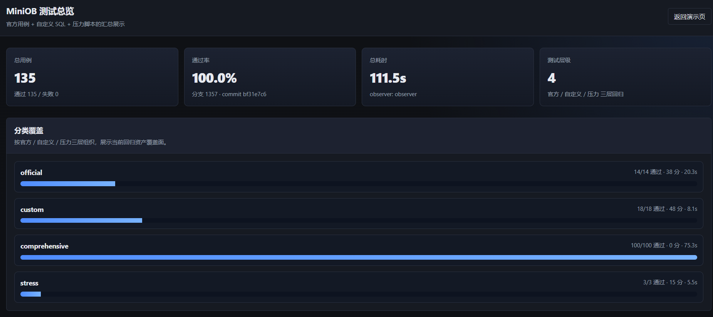
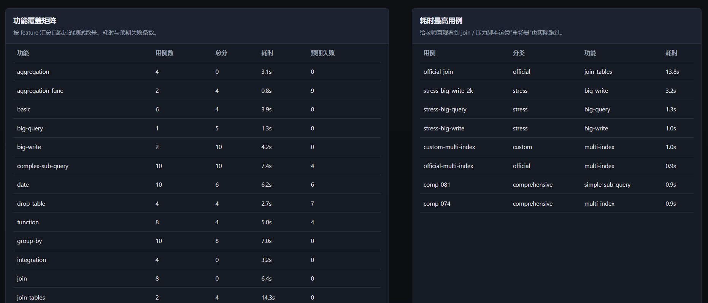
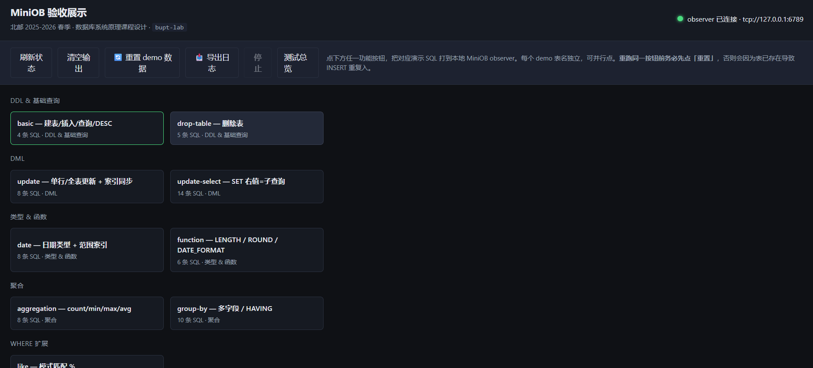
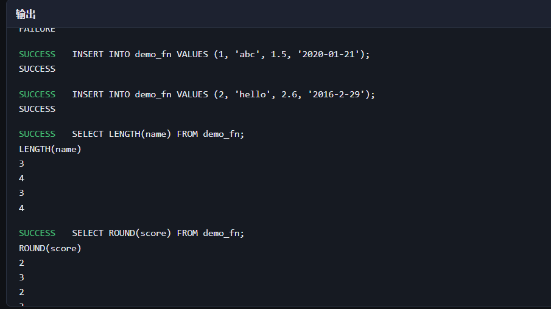
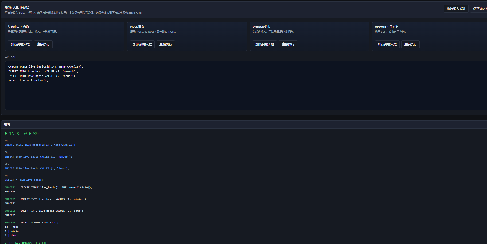

# 测试扩展报告

> 用途：作为主报告「§4 系统测试与结果分析」的插图补充，正文与主报告第四章一致，截图仅作可视化添头。

---

## 4. 系统测试与结果分析

### 4.1 测试环境与方法

全量回归在 macOS 本机执行，编译命令为 `bash build.sh debug --make -j8`，observer 路径为 `build_debug/bin/observer`，回归入口为 `python3 lab/test/run_all.py`（无 `--quick`）。测试数据来源 `lab/test/latest.md`（2026-06-03，分支 `1357`，commit `bf31e7c6`）。

测试方法为：脚本按 `lab/test/manifest.json` 顺序启动 observer、执行用例 SQL、统计 SUCCESS/FAILURE 行数并与 `expected_failure` 比对；带 `assertions` 的用例额外比对查询结果行集；压力用例校验 `count(*)` 及 big-write 500 行场景的重启持久化。

### 4.2 回归体系构成

| 层次 | 路径 | 作用 |
|------|------|------|
| 官方 primary | `test/case/test/primary-*.test` | 与 MiniOB 官方用例对齐 |
| 自定义 SQL | `lab/test/cases/sql/*.sql` | 补充 HAVING、索引 DML、update-select 等 |
| 综合断言 | `lab/test/comprehensive/cases.json` | 100 条逐条比对结果集 |
| 压力测试 | `lab/test/stress/gen_big_*.py` | big-write / big-query |

四层体系覆盖已实现题目的语法点、边界 FAILURE 与组合场景；与 §3 具体设计形成「实现—验证」对应，但不在本章重复展开实现细节。

### 4.3 测试结果汇总

| 指标 | 数值 |
|------|------|
| 用例总数 | 135 |
| 通过 | 135 |
| 失败 | 0 |
| 跳过 | 0 |
| 通过率 | 100.0% |
| 总耗时 | 111.5 s |

用例构成：14 项官方 primary + 18 项自定义 SQL + 100 项综合断言 + 3 项压力测试。

验收前端测试总览页（`/tests.html`）读取同一套 `lab/test/latest.json`，汇总结果与上表一致（见图 4-1、图 4-2）。

*图 4-1 测试总览页：全量回归结果汇总*

*图 4-2 测试总览页：分类覆盖与功能矩阵*

### 4.4 分层结果说明

**官方 primary（14/14）**：覆盖 basic、drop-table、update、date、aggregation-func、join-tables、order-by、group-by、multi-index、expression、unique、simple-sub-query、complex-sub-query、null。`function`、`update-select` 无单独 official primary 文件，由自定义 SQL 与综合断言覆盖。

**自定义 SQL（18/18）**：补充 update-index、date-delete、HAVING 行集断言、unique 行数断言、子查询与 update-select 等场景，全部通过。

**综合断言（100/100）**：`comp-001` 至 `comp-110` 等用例覆盖 basic 至 integration 组合，逐条比对查询结果行集，全部通过。

**压力测试（3/3）**：big-write 500 行（count=420，含重启）、big-write 2k（count=1680）、big-query（count=800），全部通过。

### 4.5 代表性用例与结果分析

| 编号 | 测试功能 | 输入 / 操作 | 预期结果 | 实际结果 | 结论 |
|------|----------|-------------|----------|----------|------|
| TC-01 | NULL 过滤 | `WHERE score IS NULL` | 返回空值行 | 与预期一致 | 通过 |
| TC-02 | 非关联子查询 | `WHERE id IN (SELECT …)` | 按子查询结果过滤 | 与预期一致 | 通过 |
| TC-03 | 关联子查询 | 内层引用外层列 | 逐行关联匹配 | 与预期一致 | 通过 |
| TC-04 | update-select | SET 右值为标量子查询 | 命中行更新成功 | 与预期一致 | 通过 |
| TC-05 | 唯一索引 | 重复键插入 | FAILURE | 与预期一致 | 通过 |
| TC-06 | big-write | 500 次混合写 + 重启 | count(*)=420 | 与预期一致 | 通过 |
| TC-07 | big-query | 800 行压力脚本 | count(*)=800 | 与预期一致 | 通过 |

从测试结果可以看出，系统在正常输入与边界输入（预期 FAILURE）条件下，实际输出与用例设计一致。135 组自动化用例全部通过，说明 §3 各功能域在当前覆盖范围内具备基本正确性与稳定性。测试主要集中于功能正确性与中等规模数据；高并发、超大规模外部排序（big-order-by）等场景未纳入本次实现与测试范围。`lab/test/latest.md` 与 `lab/test/latest.json` 可作为书面报告、终端演示和后续验收核对的统一依据。

以下为验收前端功能演示界面，便于对照上表代表性用例进行现场展示（见图 4-3～图 4-5）。

*图 4-3 验收展示前端主页*

*图 4-4 功能演示：basic 建表 / 插入 / 查询*

*图 4-5 现场 SQL 控制台*
