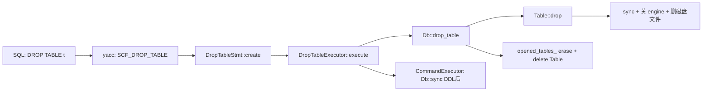

# MiniOB 课程设计开发日志

> 仓库：`miniob-sql-task-2`（fork 自官方 MiniOB）  
> 分支：`bupt-lab`  
> 个人工作区：`yys/`（`.git/info/exclude`，不提交）  
> 记录时间：2026-06-02  

---

## 1. 任务说明（题目在要什么）

### 1.1 课程定位

- **题目**：数据库系统原理课程设计 — 基于 MiniOB 的 DBMS 设计与实现  
- **目标**：读懂并修改 MiniOB 源码（C/C++），补全约 **25 道功能题**  
- **验收**：能编译运行、用 SQL 演示、报告说明设计与测试；老师看 **源码 diff + 运行效果**  

### 1.2 与本仓库相关的硬性要求

| 要求 | 做法 |
|------|------|
| 修改官方代码 | 只提交 `src/` 等功能目录，每题一个 commit |
| 本地可测 | `build` + CLI/Socket 跑 SQL |
| 个人笔记不入库 | `yys/` 放脚本、自测 SQL、本文档 |

### 1.3 25 题中的优先级（5h 速成策略）

| 顺序 | 题目 | 分值 | 本次状态 |
|------|------|------|----------|
| 0 | basic | 2 | ✅ 不改代码即可 |
| 1 | **drop-table** | 2 | ✅ 已实现并自测 |
| 2 | update | 2 | ⏳ 待做 |
| 3 | date | 2 | ⏳ 第二晚 |
| … | join / 子查询等 | — | 暂缓 |

官方参考用例：`test/case/test/primary-drop-table.test`  
本地精简用例：`yys/test/drop-table.sql`

---

## 2. 仓库与分支约定

```text
origin  → 自己的 fork（如 tanteijms/miniob-sql-task-2）
upstream → oceanbase/miniob（可选，同步官方）

工作分支：bupt-lab
提交范围：仅 src/（drop-table 示例：git commit -m "feat: drop-table"）
```

**本地 Git 配置（避免误提交）：**

- `.git/info/exclude` 增加 `yys/`  
- `git config submodule.deps/3rd/*.ignore all`（子模块指针变动不再弹 GitHub Desktop）  
- 脚本：`./yys/scripts/dev.sh ignore-deps`  

---

## 3. 环境搭建日志（Mac 本机）

### 3.1 前置工具

| 工具 | 用途 | 本机情况 |
|------|------|----------|
| Xcode CLT | 编译器 | ✅ |
| Homebrew | cmake 等 | ✅ |
| cmake / flex / bison | 构建与语法生成 | ✅（bison 必须用 **3.x**） |
| Docker | 可选 | 未装，走本机路径 |

**重要：** 系统 `/usr/bin/bison` 为 **2.3**，无法解析 `yacc_sql.y` 里 Bison 3 语法（`%define api.pure full`）。  

```bash
brew install bison
echo 'export PATH="/opt/homebrew/opt/bison/bin:$PATH"' >> ~/.zshrc
source ~/.zshrc
bison --version   # 应为 3.8.x
```

### 3.2 步骤记录

| 步骤 | 命令 | 结果 / 备注 |
|------|------|-------------|
| 1 | `git checkout -b bupt-lab` | ✅ |
| 2 | `git submodule update --init --recursive` | ✅ |
| 3 | 固定 libevent / jsoncpp 版本 | `libevent → 112421c8`，`jsoncpp → 1.9.6` |
| 4 | `bash build.sh init` | libevent / gtest / benchmark / jsoncpp 成功；**replxx 曾失败** |
| 4b | replxx 修复 | `deps/3rd/replxx` 内 `git reset --hard HEAD` 后单独 cmake+make install |
| 5 | `bash build.sh debug --make -j8` | 首次因 bison 2.3 失败；换 bison 3 后 ✅ |
| 6 | `./yys/scripts/dev.sh demo` | ✅（首行 `--` 注释会 SQL_SYNTAX，可忽略） |
| 7 | `./yys/scripts/dev.sh run test/basic.sql` | ✅ |

**编译产物：**

- `build_debug/bin/observer`（`build` 为指向 `build_debug` 的软链）  
- 数据目录（CLI 运行时）：`build_debug/bin/miniob/db/sys/`  

**常用脚本：**

```bash
./yys/scripts/dev.sh build      # 改代码后编译
./yys/scripts/dev.sh run test/xxx.sql
./yys/scripts/dev.sh server     # 答辩演示
./yys/scripts/dev.sh client
```

### 3.3 踩坑汇总

| 现象 | 原因 | 处理 |
|------|------|------|
| `yacc_sql.y:55 syntax error` | bison 2.3 太旧 | Homebrew bison 3 + PATH |
| `replxx` 无 CMakeLists.txt | 子模块文件被误删 | `git reset --hard` 后单独编译 replxx |
| `init` 在 replxx 处中断 | 同上 | 不必整段重跑 init，只补 replxx |
| GitHub Desktop 显示 deps/3rd 变更 | init 改了子模块指针 | `submodule.*.ignore = all` |
| `CREATE` 第一个 FAILURE | 上次测试残留 `dt.table` | `rm -rf build_debug/bin/miniob/db/sys/dt.*` |
| 粘贴带 `#` 的命令 | zsh 把 `#` 当命令 | 不要复制注释行 |

---

## 4. drop-table 任务说明

### 4.1 功能要求（语义）

- `DROP TABLE 表名`：删除表及关联资源（元数据、数据文件、索引文件等）  
- 表不存在 → 返回失败（`FAILURE` / `SCHEMA_TABLE_NOT_EXIST`）  
- 删除后可 **同名再 CREATE**  
- 有数据的表、带索引的表也应能删除（官方 case 覆盖）  

### 4.2 官方已有 vs 缺失

| 层次 | 改前状态 |
|------|----------|
| 词法/语法 `yacc_sql.y` | ✅ 已有 `drop_table_stmt` → `SCF_DROP_TABLE` |
| `Stmt::create_stmt` | ❌ 无 `SCF_DROP_TABLE` 分支 |
| `CommandExecutor` | ❌ 无 `DROP_TABLE` |
| `Db::drop_table` | ❌ 无 |
| `DefaultHandler::drop_table` | ❌ `UNIMPLEMENTED`（旧接口，未走这条路径） |

现代 main 分支 DDL 走：**Parser → Stmt → CommandExecutor → Db**，与 `CREATE TABLE` 同路径，**不必**只改 `default_handler.cpp`。

### 4.3 本地自测 SQL（`yys/test/drop-table.sql`）

```sql
CREATE TABLE dt(id INT, name CHAR(10));
INSERT INTO dt VALUES (1, 'x');
DROP TABLE dt;
CREATE TABLE dt(id INT);
INSERT INTO dt VALUES (1);
SELECT * FROM dt;
DROP TABLE dt_not_exist;
```

**期望（实现后）：**

- 5 × `SUCCESS` + 1 × `FAILURE`（删不存在的表）  
- `SELECT` 只有列 `id`，值为 `1`（说明旧表已删、新表已建）  

**实测（2026-06-02）：**

```text
SQL_SYNTAX          -- 首行 -- 注释，忽略
SUCCESS × 5
id / 1              -- SELECT 结果
FAILURE             -- DROP dt_not_exist
```

---

## 5. 代码改动说明（对照 CREATE TABLE）

### 5.1 调用链（实现后）



### 5.2 新增文件

| 文件 | 职责 |
|------|------|
| `src/observer/sql/stmt/drop_table_stmt.h` | Stmt 对象，保存表名 |
| `src/observer/sql/stmt/drop_table_stmt.cpp` | `create()`：表不存在则 `SCHEMA_TABLE_NOT_EXIST` |
| `src/observer/sql/executor/drop_table_executor.h` | 执行器声明 |
| `src/observer/sql/executor/drop_table_executor.cpp` | 调 `session->get_current_db()->drop_table()` |

### 5.3 修改文件

| 文件 | 改动要点 |
|------|----------|
| `sql/stmt/stmt.cpp` | `case SCF_DROP_TABLE` → `DropTableStmt::create` |
| `sql/executor/command_executor.cpp` | `case StmtType::DROP_TABLE` → `DropTableExecutor` |
| `storage/db/db.h` | 声明 `RC drop_table(const char *table_name)` |
| `storage/db/db.cpp` | `find_table` → `table->drop()` → 从 `opened_tables_` 移除并 `delete` |
| `storage/table/table.h` | 声明 `RC drop()` |
| `storage/table/table.cpp` | 见下节 |

### 5.4 核心逻辑：`Table::drop()`

1. **`sync()`**：刷脏页到盘  
2. **收集索引名**（`table_meta_.index(i)`）  
3. **`engine_.reset()`**：析构 `HeapTableEngine`，内部 `close_file()`，从 Buffer Pool 管理器移除数据文件  
4. **删除磁盘文件**（`base_dir` 一般为 `miniob/db/sys`）：  
   - `{表名}.table` — 元数据  
   - `{表名}.data` — 堆表数据  
   - `{表名}.lob` — LOB（若存在）  
   - `{表名}-{索引名}.index` — 每个索引  
5. 由 **`Db::drop_table`** 负责 `opened_tables_.erase` 与 `delete table`  

### 5.5 与 `CREATE TABLE` 的对称关系

| CREATE TABLE | DROP TABLE |
|--------------|------------|
| `CreateTableStmt` | `DropTableStmt` |
| `CreateTableExecutor` | `DropTableExecutor` |
| `Db::create_table` | `Db::drop_table` |
| `Table::create` + 建文件 | `Table::drop` + 删文件 |

DDL 完成后 `CommandExecutor` 会对所有 DDL 调 `Db::sync()`（原有逻辑，未改）。

### 5.6 未改动的部分

- `default_handler.cpp` 中 `drop_table` 仍为 `UNIMPLEMENTED`（当前会话不走该接口）  
- 语法文件 `yacc_sql.y` 无需改  

---

## 6. 测试与验证命令

```bash
cd /Users/yishuoyan/projects/bupt/25-26-2/miniob-sql-task-2
export PATH="/opt/homebrew/opt/bison/bin:$PATH"

bash build.sh debug --make -j8
./yys/scripts/dev.sh run test/drop-table.sql

# 可选：清残留表后再测
rm -rf build_debug/bin/miniob/db/sys/dt.*
./yys/scripts/dev.sh run test/drop-table.sql
```

**提交：**

```bash
git add src/
git commit -m "feat: drop-table"
```

---

## 7. 答辩演示建议（2 分钟）

1. `git log -1 --oneline` — 展示 commit  
2. `./yys/scripts/dev.sh run test/drop-table.sql` — CLI 一键演示  
3. 或双终端：`server` + `client`，手敲：

```sql
CREATE TABLE t(id INT, name CHAR(10));
INSERT INTO t VALUES (1, 'a');
DROP TABLE t;
CREATE TABLE t(id INT);
INSERT INTO t VALUES (1);
SELECT * FROM t;
```

说明要点：**语法已有 → 补 Stmt/Executor/存储层 → 删内存表项 + 磁盘文件 + Buffer Pool 释放**。

---

## 8. 进度总览

| 阶段 | 状态 | 说明 |
|------|------|------|
| 脚手架 `yys/` + `dev.sh` | ✅ | exclude、ignore-deps |
| 环境 init + build | ✅ | 本机 Mac，无 Docker |
| basic / demo | ✅ | 不改代码 |
| **drop-table** | ✅ | 5 SUCCESS + 1 FAILURE |
| update | ⏳ | 下一题 |
| date | ⏳ | 计划第二晚 |
| 报告 25 题方案描述 | ⏳ | 可先写设计，实现逐步补 |

---

## 9. 参考资料（仓库内）

| 路径 | 内容 |
|------|------|
| `yys/doc/速成/本地速通.md` | 环境、题目顺序、改代码入口 |
| `yys/doc/task.md` | 课程题目完整分析 |
| `test/case/test/primary-drop-table.test` | 官方 drop-table 用例 |
| `yys/test/drop-table.sql` | 本地精简自测 |

---

## 10. 修订记录

| 日期 | 内容 |
|------|------|
| 2026-06-02 | 初稿：环境搭建全过程 + drop-table 实现与自测 |
