# MiniOB 课程设计开发日志 — update

> 仓库：`miniob-sql-task-2`（fork 自官方 MiniOB）  
> 分支：`bupt-lab`  
> 个人工作区：`yys/`（`.git/info/exclude`，不提交）  
> 记录时间：2026-06-02  
> 前置文档：[01开发日志-环境与drop-table.md](./01开发日志-环境与drop-table.md)

---

## 1. 任务说明（题目在要什么）

### 1.1 功能要求（语义）

- `UPDATE 表 SET 字段 = 值 [WHERE 条件]`：更新**单个字段**（语法已限定）  
- 支持 **带 WHERE** 更新部分行、**不带 WHERE** 更新全表  
- 表上有 **索引** 时，更新索引列或非索引列都要保持 B+ 树与堆表一致  
- 表不存在、字段不存在、条件字段非法、类型无法转换 → 应失败（官方 `primary-update.test` 6–10）  

### 1.2 官方已有 vs 缺失（改前）

| 层次 | 改前状态 |
|------|----------|
| 词法/语法 `yacc_sql.y` | ✅ `update_stmt` → `SCF_UPDATE`，`UpdateSqlNode` |
| `UpdateStmt::create` | ❌ `return RC::INTERNAL`（空实现） |
| `Stmt::create_stmt` | ❌ 无 `SCF_UPDATE` 分支 |
| 逻辑/物理计划 | ❌ 无 UPDATE 算子 |
| `HeapTableEngine::update_record_with_trx` | ❌ `RC::UNSUPPORTED` |
| `VacuousTrx::update_record` | ❌ `RC::UNIMPLEMENTED` |

与 **DELETE** 同路径：走 **Stmt → 逻辑计划 → 物理算子 → Trx → Table/Engine**，不是 DDL，不走 `CommandExecutor`。

### 1.3 本地与官方用例

| 文件 | 用途 |
|------|------|
| `yys/test/update.sql` | 本地精简：条件更新 + 全表更新 + 索引表 |
| `yys/test/update-index.sql` | 补充：更新索引列 `id` |
| `test/case/test/primary-update.test` | 官方完整场景（含错误用例） |

指导书提示：可参考 delete + insert；本实现采用 **原地改记录 + 索引先删后插**（与 `RecordFileHandler::visit_record` 一致）。

---

## 2. 测试结果

### 2.1 结论：**通过（需在干净库上测）**

在清除残留表文件后，`yys/test/update.sql` 行为符合预期。

**注意：** 若上次测试留下 `ut.*` / `Update_table_1.*`，`CREATE TABLE` 或 `CREATE INDEX` 可能 `FAILURE`（`SCHEMA_DB_EXIST` / 索引文件已存在），**不是 UPDATE 逻辑错误**。测前执行：

```bash
rm -f build_debug/bin/miniob/db/sys/ut* \
      build_debug/bin/miniob/db/sys/Update_table_1*
```

### 2.2 `yys/test/update.sql` 实测（干净库，2026-06-02）

```text
SQL_SYNTAX          -- 首行 -- 注释，忽略
SUCCESS             -- CREATE TABLE ut
SUCCESS             -- CREATE INDEX i_ut_id ON ut(id)
SUCCESS × 3         -- INSERT × 2 + UPDATE WHERE id=1
id | name | col1
1 | N01 | 1         -- 仅 id=1 的 name 被改
2 | N2 | 1
SUCCESS             -- UPDATE ut SET col1=0（全表）
id | name | col1
1 | N01 | 0
2 | N2 | 0
```

与脚本注释中的期望一致。

### 2.3 `yys/test/update-index.sql`（索引列更新）

```text
SUCCESS × 5         -- 建表、索引、插入、UPDATE id
id | t_name | col1 | col2
1 | N1 | 1 | 1
2 | N2 | 1 | 1
4 | N3 | 2 | 1      -- 原 id=3 行已变为 id=4，索引同步正常
```

### 2.4 与 `primary-update.test` 的对应关系

| 官方场景 | 本实现 |
|----------|--------|
| 1. 单行条件更新 | ✅ |
| 2. 多行条件更新 | ✅ |
| 3. 更新索引列 | ✅（见 update-index.sql） |
| 4. 无条件全表更新 | ✅ |
| 5. 多条件 WHERE | ✅（FilterStmt 与 DELETE 共用） |
| 6–8. 表/列/条件不存在 | ✅ Stmt / FilterStmt 阶段报错 |
| 9. 条件无匹配行 | ✅（0 行更新，仍 SUCCESS） |
| 10. 非法类型赋值 | ✅ `Value::cast_to` 失败 |

未在本机跑官方 `ob_shell` 集成框架时，以 CLI + 上述 SQL 为准；答辩前可在干净库再跑一遍 `update.sql`。

---

## 3. 代码改动说明

### 3.1 调用链（实现后）

```mermaid
flowchart LR
  A[SQL: UPDATE t SET col=v WHERE ...] --> B[yacc: SCF_UPDATE]
  B --> C[UpdateStmt::create]
  C --> D[LogicalPlan: TableGet + Predicate + Update]
  D --> E[UpdatePhysicalOperator::open]
  E --> F[子算子扫描匹配行]
  F --> G[拷贝记录 + set_record_value]
  G --> H[VacuousTrx::update_record]
  H --> I[HeapTableEngine::update_record_with_trx]
  I --> J[删旧索引项 → visit_record 写盘 → 插新索引项]
```



### 3.2 新增文件

| 文件 | 职责 |
|------|------|
| `sql/operator/update_logical_operator.h/.cpp` | 逻辑算子，保存表、字段、新值 |
| `sql/operator/update_physical_operator.h/.cpp` | 扫描子树收集行，逐条更新 |

### 3.3 修改文件（按层次）

**Stmt**

| 文件 | 改动要点 |
|------|----------|
| `sql/stmt/update_stmt.h` | 增加 `FilterStmt`、`FieldMeta`、`Value` 成员 |
| `sql/stmt/update_stmt.cpp` | 实现 `create()`：查表/字段、类型转换、`FilterStmt::create` |
| `sql/stmt/stmt.cpp` | `case SCF_UPDATE` → `UpdateStmt::create` |

**优化器 / 算子枚举**

| 文件 | 改动要点 |
|------|----------|
| `sql/operator/logical_operator.h` | `LogicalOperatorType::UPDATE` |
| `sql/operator/physical_operator.h` | `PhysicalOperatorType::UPDATE` |
| `sql/operator/logical_operator.cpp` | 向量化黑名单加入 UPDATE |
| `sql/operator/physical_operator.cpp` | 打印名 `UPDATE` |
| `sql/optimizer/logical_plan_generator.*` | `StmtType::UPDATE` + `create_plan(UpdateStmt*)`（镜像 DELETE） |
| `sql/optimizer/physical_plan_generator.*` | `UpdateLogicalOperator` → `UpdatePhysicalOperator` |

**存储 / 事务**

| 文件 | 改动要点 |
|------|----------|
| `storage/table/table.h/.cpp` | 公开 `set_record_value()`，供算子写字段 |
| `storage/table/heap_table_engine.h/.cpp` | 实现 `update_record_with_trx`（索引维护 + 失败回滚） |
| `storage/trx/vacuous_trx.h/.cpp` | `update_record` → `table->update_record_with_trx` |

### 3.4 核心逻辑

**`UpdatePhysicalOperator::open`**

1. 打开子算子（`TableGet` + 可选 `Predicate`），`next()` 收集所有 `Record`  
2. 对每条旧记录：`copy_data` → `set_record_value` → `trx_->update_record`  

**`HeapTableEngine::update_record_with_trx`**

1. `delete_entry_of_indexes(old)`  
2. `record_handler_->visit_record(rid, memcpy 新数据)`  
3. `insert_entry_of_indexes(new)`；任一步失败则尝试恢复旧数据与旧索引  

**与 DELETE 的对称**

| DELETE | UPDATE |
|--------|--------|
| `DeleteStmt` + `FilterStmt` | `UpdateStmt` + `FilterStmt` + 字段/值 |
| `DeleteLogicalOperator` | `UpdateLogicalOperator` |
| `DeletePhysicalOperator` 收集行后 `delete_record` | 收集行后 `update_record` |

---

## 4. 测试与验证命令

```bash
cd /Users/yishuoyan/projects/bupt/25-26-2/miniob-sql-task-2
export PATH="/opt/homebrew/opt/bison/bin:$PATH"

bash build.sh debug --make -j8

# 清残留后测
rm -f build_debug/bin/miniob/db/sys/ut* \
      build_debug/bin/miniob/db/sys/Update_table_1*

./yys/scripts/dev.sh run test/update.sql
./yys/scripts/dev.sh run yys/test/update-index.sql
```

---

## 5. 建议提交（三层 commit，与 drop-table 一致）

**存储 + 事务**

```bash
git add src/observer/storage/table/table.h \
        src/observer/storage/table/table.cpp \
        src/observer/storage/table/heap_table_engine.h \
        src/observer/storage/table/heap_table_engine.cpp \
        src/observer/storage/trx/vacuous_trx.h \
        src/observer/storage/trx/vacuous_trx.cpp

git commit -m "$(cat <<'EOF'
feat(storage): implement heap table update with index maintenance

Add Table::set_record_value, HeapTableEngine::update_record_with_trx,
and VacuousTrx::update_record.
EOF
)"
```

**Stmt**

```bash
git add src/observer/sql/stmt/update_stmt.h \
        src/observer/sql/stmt/update_stmt.cpp \
        src/observer/sql/stmt/stmt.cpp

git commit -m "$(cat <<'EOF'
feat(stmt): add UpdateStmt for UPDATE with WHERE support

Wire SCF_UPDATE into Stmt::create_stmt with field and type checks.
EOF
)"
```

**算子 + 优化器**

```bash
git add src/observer/sql/operator/update_logical_operator.h \
        src/observer/sql/operator/update_logical_operator.cpp \
        src/observer/sql/operator/update_physical_operator.h \
        src/observer/sql/operator/update_physical_operator.cpp \
        src/observer/sql/operator/logical_operator.h \
        src/observer/sql/operator/logical_operator.cpp \
        src/observer/sql/operator/physical_operator.h \
        src/observer/sql/operator/physical_operator.cpp \
        src/observer/sql/optimizer/logical_plan_generator.h \
        src/observer/sql/optimizer/logical_plan_generator.cpp \
        src/observer/sql/optimizer/physical_plan_generator.h \
        src/observer/sql/optimizer/physical_plan_generator.cpp

git commit -m "$(cat <<'EOF'
feat(executor): add UPDATE logical/physical operators and plan generation

Complete UPDATE execution path mirroring DELETE scan-then-mutate pattern.
EOF
)"
```

---

## 6. 答辩演示建议（2 分钟）

1. `git log -3 --oneline` — 展示 drop-table + update 相关 commit  
2. 清库后：`./yys/scripts/dev.sh run test/update.sql`  
3. 口述链路：**Parser 已有 → 补 Stmt → 计划与 UPDATE 算子 → 存储层改记录并维护索引**  

可强调与 DELETE 同构、索引列更新时「先删索引项再插入」。

---

## 7. 踩坑

| 现象 | 原因 | 处理 |
|------|------|------|
| 首条 `SQL_SYNTAX` | `update.sql` 首行 `--` 注释 | 忽略或删掉注释行 |
| `CREATE` / `CREATE INDEX` FAILURE | 残留 `ut.*`、索引文件 | `rm -f .../sys/ut*` |
| `SELECT` 出现重复行 | 未清库多次 `CREATE` 失败后又插入 | 清库重测 |
| `set_value_to_record` 编译错误 | 原为 `Table` 私有方法 | 增加公开 `set_record_value` |

---

## 8. 进度总览（相对 01 文档）

| 阶段 | 状态 | 说明 |
|------|------|------|
| 环境 / basic / demo | ✅ | 见 01 文档 |
| drop-table | ✅ | 见 01 文档 |
| **update** | ✅ | 本文档 |
| date | ⏳ | 建议下一题 |
| aggregation / like 等 | ⏳ | 按速成优先级 |

---

## 9. 参考资料

| 路径 | 内容 |
|------|------|
| `yys/doc/速成/MiniOB.md` §1.4 update | 题目描述与提示 |
| `test/case/test/primary-update.test` | 官方用例 |
| `yys/test/update.sql` | 本地精简自测 |
| `yys/test/update-index.sql` | 索引列更新补充 |
| [01开发日志-环境与drop-table.md](./01开发日志-环境与drop-table.md) | 环境与 drop-table |

---

## 10. 修订记录

| 日期 | 内容 |
|------|------|
| 2026-06-02 | 初稿：update 实现、干净库自测结果、分层 commit 与答辩要点 |
