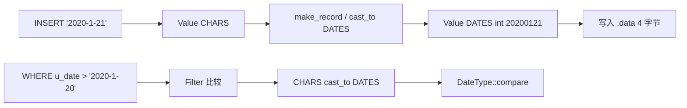

# MiniOB 课程设计开发日志 — date

> 仓库：`miniob-sql-task-2`（fork 自官方 MiniOB）  
> 分支：`bupt-lab`  
> 个人工作区：`yys/`（`.git/info/exclude`，不提交）  
> 记录时间：2026-06-02  
> 前置文档：[01开发日志-环境与drop-table.md](./01开发日志-环境与drop-table.md)、[02开发日志-update.md](./02开发日志-update.md)

---

## 1. 任务说明（题目在要什么）

### 1.1 功能要求（语义）

- 在已有 `int` / `char` / `float` 基础上，支持 **`date` 字段类型**  
- `CREATE TABLE ... (col date)`、`INSERT` 日期字面量、`SELECT ... WHERE` 按日期比较  
- 日期字面量格式灵活：`2020-01-21`、`2020-1-01`、`2016-2-29` 等  
- **非法日期**（如 `2017-2-29`、`2017-12-32`）插入应 **FAILURE**  
- 需处理 **闰年**；题目不限制年份范围（可小于 1970、可超过 2038）  
- **date 列建索引** 时，比较与更新索引键必须正确（官方常见踩坑点）

### 1.2 官方已有 vs 缺失（改前）

| 层次 | 改前状态 |
|------|----------|
| 词法 `lex_sql.l` | ❌ 无 `DATE` 关键字 |
| 语法 `yacc_sql.y` | ❌ `type` 规则无 `date` |
| `AttrType` | ❌ 无 `DATES` |
| `Value` / `DataType` | ❌ 无日期解析与比较 |
| `INSERT` / `WHERE` | 字符串无法转为 date 类型字段 |

与 drop-table / update 不同：date 是 **贯穿词法 → 类型系统 → 存储 → 比较/索引** 的改造，不是单点 Executor。

### 1.3 本地与官方用例

| 文件 | 用途 |
|------|------|
| `yys/test/date.sql` | 建表、索引、合法/非法插入、条件查询 |
| `yys/test/date-delete.sql` | 带 date 条件的 `DELETE` |
| `test/case/test/primary-date.test` | 官方完整场景（含比较、删除、非法数据） |

---

## 2. 测试结果

### 2.1 结论：**通过（需在干净库上测）**

清除 `build_debug/bin/miniob/db/sys/dt*` 后，本地自测通过。

**注意：** 若残留 `dt.table` / `dt.data` / `dt-*.index`，`CREATE` 或 `CREATE INDEX` 可能 `FAILURE`（`File exists` / `SCHEMA_DB_EXIST`），与 date 逻辑无关。

### 2.2 `yys/test/date.sql` 实测（2026-06-02）

```text
SUCCESS             -- CREATE TABLE dt(...)
SUCCESS             -- CREATE INDEX i_dt_date ON dt(u_date)
SUCCESS × 5         -- 合法 INSERT（含 2016-2-29、1970-1-1）
id | u_date
1 | 2020-1-21       -- WHERE u_date>'2020-1-20'
2 | 2020-10-21
id | u_date
3 | 2020-1-1        -- WHERE u_date='2020-1-1'
FAILURE × 2         -- 2017-2-29、2017-12-32
```

### 2.3 `yys/test/date-delete.sql`

```text
SUCCESS × 4         -- 建表、插入 2 行、DELETE WHERE u_date>'2012-2-29'
id | u_date          -- 空结果（两行均被条件命中删除）
```

### 2.4 与 `primary-date.test` 的对应

| 官方场景 | 本实现 |
|----------|--------|
| 多种合法日期格式 INSERT | ✅ |
| `>` / `<` / `=` 比较 | ✅ |
| date 列索引 | ✅ |
| DELETE + date 条件 | ✅ |
| 非法日期 INSERT | ✅ FAILURE |
| 非法日期仅出现在 WHERE（不插入） | ✅（无匹配行） |

---

## 3. 设计要点

### 3.1 存储格式

- 新增 `AttrType::DATES`，**4 字节 int**，编码：`YYYYMMDD`（如 `2020-01-21` → `20200121`）  
- 与 `INT` 相同占用，堆表记录直接 `memcpy`，索引键比较走 `Value::compare`  

### 3.2 解析与校验

`DateType::parse_date(const char *str, int &encoded)`：

1. `sscanf("%d-%d-%d")` 解析年/月/日（允许个位数月日）  
2. 校验 `1 ≤ month ≤ 12`、`day ≥ 1`  
3. `days_in_month(year, month)`，闰年 2 月 29 天  
4. 失败返回 `false`，上层 `INSERT` 得到 `SCHEMA_FIELD_TYPE_MISMATCH` → CLI **FAILURE**

展示：`DateType::format_date` → `"YYYY-M-D"`（与测试输出一致，不强制补零）。

### 3.3 数据流



- **INSERT**：`Table::make_record` → `Value::cast_to` → `CharType::cast_to(DATES)`  
- **WHERE**：`logical_plan_generator` 隐式转换，`CharType` → `DateType` 比较  
- **索引**：B+ 树键为记录中 date 字段 4 字节，与 int 索引路径相同  

---

## 4. 代码改动说明

### 4.1 新增文件

| 文件 | 职责 |
|------|------|
| `src/observer/common/type/date_type.h` | `DateType` 声明 |
| `src/observer/common/type/date_type.cpp` | 解析、格式化、`compare`、`cast_to`、`to_string` |

### 4.2 修改文件

| 文件 | 改动要点 |
|------|----------|
| `common/type/attr_type.h` | 增加 `AttrType::DATES`（在 `FLOATS` 与 `VECTORS` 之间） |
| `common/type/attr_type.cpp` | `ATTR_TYPE_NAME` 增加 `"dates"` |
| `common/type/data_type.cpp` | `type_instances_` 注册 `DateType` |
| `common/type/char_type.cpp` | `cast_to(DATES)`、`cast_cost` |
| `common/value.h` / `value.cpp` | `set_date()`；`set_data` / `get_int` / `set_value` 支持 `DATES` |
| `sql/parser/lex_sql.l` | `DATE` → `DATE_T` |
| `sql/parser/yacc_sql.y` | `DATE_T` → `AttrType::DATES`；需重新 bison 生成 |

### 4.3 未改动的部分

- Stmt / Executor / 算子层：**无新增**，复用现有 INSERT/SELECT/DELETE/UPDATE 链路  
- `yacc` 的 `value` 规则仍为字符串 `SSS`，日期以引号字面量进入，在 **类型转换** 阶段变为 `DATES`  

---

## 5. 测试与验证命令

```bash
cd /Users/yishuoyan/projects/bupt/25-26-2/miniob-sql-task-2
export PATH="/opt/homebrew/opt/bison/bin:$PATH"

bash build.sh debug --make -j8

# 清残留（无文件时 zsh 可能报错，可忽略）
rm -f build_debug/bin/miniob/db/sys/dt*

./yys/scripts/dev.sh run test/date.sql
./yys/scripts/dev.sh run test/date-delete.sql
```

**手动答辩 SQL：**

```sql
CREATE TABLE t(id int, d date);
CREATE INDEX idx ON t(d);
INSERT INTO t VALUES (1,'2020-01-21');
INSERT INTO t VALUES (2,'2016-2-29');
SELECT * FROM t WHERE d>'2020-1-1';
INSERT INTO t VALUES (3,'2017-2-29');   -- 期望 FAILURE
```

---

## 6. 建议提交

```bash
git add src/observer/common/type/attr_type.h \
        src/observer/common/type/attr_type.cpp \
        src/observer/common/type/date_type.h \
        src/observer/common/type/date_type.cpp \
        src/observer/common/type/data_type.cpp \
        src/observer/common/type/char_type.cpp \
        src/observer/common/value.h \
        src/observer/common/value.cpp \
        src/observer/sql/parser/lex_sql.l \
        src/observer/sql/parser/yacc_sql.y

git commit -m "$(cat <<'EOF'
feat: add DATE type (parse, compare, storage, SQL syntax)

Support date columns as YYYYMMDD int with leap-year validation,
CHAR literal casting, and index-friendly comparison.
EOF
)"
```

---

## 7. 答辩演示建议（2 分钟）

1. 说明 **编码**：`date` 存成 4 字节整数，便于比较和索引  
2. 跑 `dev.sh run test/date.sql`，指出合法 INSERT 成功、非法 FAILURE  
3. 强调 **索引**：`CREATE INDEX ON date列` 后 `WHERE` 仍正确  
4. 与 01/02 串联：DDL 删表 → DML 更新 → **类型与查询**  

---

## 8. 踩坑

| 现象 | 原因 | 处理 |
|------|------|------|
| `CREATE INDEX` FAILURE | 残留 `dt-i_dt_date.index` | `rm -f .../sys/dt*` |
| 首条 `SQL_SYNTAX` | SQL 文件首行 `--` 注释 | 忽略或删注释 |
| 改 enum 后旧表 meta 不兼容 | `AttrType` 顺序变化 | 清库重建表 |
| 只改 Value 不改索引比较 | 官方提示的常见问题 | 统一走 `DataType::compare` + `cast_to` |

---

## 9. 进度总览

| 阶段 | 状态 | 说明 |
|------|------|------|
| 环境 / basic / demo | ✅ | 见 01 |
| drop-table | ✅ | 见 01 |
| update | ✅ | 见 02 |
| **date** | ✅ | 本文档 |
| aggregation-func | ⏳ | 建议下一题（3 分） |
| like | ⏳ | 再下一题（3 分） |

简单题累计约：**2+2+2+2+2 = 10 分**（含 basic），加 aggregation/like 可继续冲高。

---

## 10. 参考资料

| 路径 | 内容 |
|------|------|
| `yys/doc/速成/MiniOB.md` §1.2 date | 题目描述与索引提示 |
| `test/case/test/primary-date.test` | 官方用例 |
| `yys/test/date.sql` | 本地主自测 |
| `yys/test/date-delete.sql` | DELETE 补充 |

---

## 11. 修订记录

| 日期 | 内容 |
|------|------|
| 2026-06-02 | 初稿：date 类型实现、自测结果、提交与答辩要点 |
