# 《数据库系统原理》课程设计指导书

# 基于 MiniOB 的数据库管理系统 设计与实现

北京邮电大学计算机学院 

2026 年 2 月 

# 目录

# 一.课程设计背景介绍. 4

# 二.MiniOB 基础知识.. 5

1.MiniOB 整体架构. 5 

2.各模块工作原理简介.. 

2.1 seda 异步事件框架. 5 

2.2服务端启动过程. 6 

2.3 网络模块. 6 

2.4 SQL 解析 . 6 

2.5 执行计划.. 

2.6 元数据管理模块. . 8 

2.7 客户端. . 8 

2.8 通信协议.. . 8 

3.火山模型和算子介绍.. 8 

3.1 火山模型. . 8 

3.2MiniOB 火山模型构成过程： . 9 

3.3 算计介绍[2] . . 10 

# 三.课程设计主要内容. 12

1.题目及其基本思路. 12 

1.1basic（简单）. 12 

1.2 date（简单） .... 12 

1.3 drop-table（简单） . 13 

1.4 update（简单） . 13 

1.5 aggregation-func（简单） 14 

1.6 like（简单） 15 

1.7 join-tables（中等） ..... . 15 

1.8 simple-sub-query（中等） 16 

1.9 function（中等）. . 16 

1.10 multi-index（中等） . 17 

1.11 unique（中等） . . 17 

1.12 null（中等） .. 18 

1.13 update-select（中等） . 19 

1.14 expression（中等） . 19 

1.15 alias（中等） .. 20 

1.16 text（中等）.. .. 21 

1.17 order-by（中等） .. 21 

1.18 group-by（中等） .. 22 

1.19 create view（中等） .. 23 

1.20 create-table-select（中等） .. 23 

1.21 complex-sub-query（困难） .. 24 

1.22 update-mvcc（困难） .. 24 

1.23 big-query（困难）. .. 25 

1.24 big-write（困难） .. 25 

1.25 big-order-by（困难） .. 26 

# 四.开发环境搭建. 27

1. GitPod 介绍 . . 27 

1.1 创建自己的 GitHub 项目. .. 27 

1.2 在 GitPod 上打开自己的项目. .. 27 

1.3 代码构建. .. 28 

1.4提交代码到仓库. .. 30 

2.本地基于 Docker 环境搭建介绍. .. 30 

2.1.下载 docker ...... .. 31 

2.2.获取 oceanbase/miniob 的 docker 环境 .. 31 

2.3.在 vscode 中使用 git 对官网 MiniOB 进行 clone ，在本地创建一个代码仓库 31 

2.3.1 准备工作： ....... .. 31 

2.3.2 进入 vscode clone 代码 . .. 32 

2.4.将获取到的文件与 docker容器 映射连接. .. 33 

2.5.在 vscode 中启动 docker .. .. 35 

# 五.提交测试流程. 37

1.首先在 gitee 上面创建 MiniOB 的仓库. .. 37 

2.将本地仓库更新到远端仓库. . 38 

3.提交代码. . 38 

# 六.参考文献. 46

# 一.课程设计背景介绍

本课程设计基于 MiniOB 进行数据库管理系统的设计与实现。MiniOB 是专 为刚入门的同学设计的数据库学习项目。目标是为在校学生、数据库从业者、爱 好者或对基础技术感兴趣的人提供一个友好的数据库学习项目。MiniOB 整体代 码简洁，容易上手，设计了一系列由浅入深的题目，帮助同学们从零基础入门， 迅速了解数据库并深入学习数据库内核。同时，MiniOB 简化了许多模块，例如 不考虑并发操作、安全特性和复杂的事务管理等功能，以便更好地学习数据库实 现原理。期望通过 MiniOB 的训练，同学们能够熟练掌握数据库内核模块的功 能和协同关系，并具备一定的工程编码能力，例如内存管理、网络通信和磁盘 I/O 处理等, 这将有助于同学在未来的面试和工作中脱颖而出。 

本次课设计主要是针对数据库管理系统进行内核修改、功能添加，最终实现 一个具有核心功能的完整的数据库管理系统。需要学生掌握基本的编译原理、数 据库SQL语句、数据库基本架构、CMD 命令行、C++面向对象等知识。 

本次课程设计要求学生以小组为单位（每组不多于3人），根据课堂教学所讲 授的数据库管理系统的设计过程和开发方法，采用 1). 开发平台，如docker、linux 服务器、wxl等 ；2). 开发工具，如 C++、lex、yacc等，完成数据库管理系统相 关功能的设计与实现。 

# 二.MiniOB 基础知识

# 1.MiniOB 整体架构

MiniOB 作为一个具有基本功能的数据库，包含了需要的基本功能模块。如 图1所示包括： 

网络模块：负责与客户端交互，收发客户端请求与应答； 

SQL 解析：将用户输入的 SQL语句解析成语法树； 

⚫ 语义解析模块：将生成的语法树，转换成数据库内部数据结构（部分实 现）； 

计划执行：根据语法树描述，执行并生成结果； 

会话管理：管理用户连接、调整某个连接的参数； 

元数据管理：记录当前的数据库、表、字段和索引元数据信息； 

客户端：作为测试工具，接收用户请求，向服务端发起请求。 

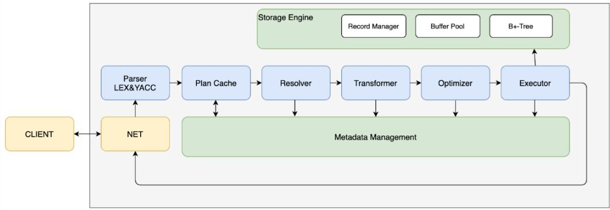


图 1.MiniOB 基本架构图


# 2. MiniOB 工作原理简介

# 2.1SEDA 异步事件框架

MiniOB使用了SEDA框架，在介绍其它模块之前有必要先了解一下SEDA。 SEDA 全称是：stage event driver architecture，它旨在结合事件驱动和多线程模式 两者的优点，从而做到易扩展，解耦合，高并发。 各个stage之间的通信由 event 来传递，event 的处理由 stage的线程池异步处理。线程池内部会维护一个事件队 列。 在MiniOB 中，从接收请求开始，到 SQL解析、查询优化、计划执行都使 用event 来传递数据，并且可以通过 SEDA来配置线程池的个数。 

# 2.2 服务端启动过程

虽然代码是模块化的，并且面向对象设计思想如此流行，但是很多同学还是 喜欢从 main 函数（参考 main@src/observer/main.cpp）看起。那么就先介绍一下 服务端的启动流程。启动流程大致如下： 

1. 解析命令行参数 parse_parameter@src/observer/main.cpp 

2. 加载配置文件 Ini::load@deps/common/conf/ini.cpp 

3. 初始化日志 init_log@src/observer/init.cpp 

4. 初始化 seda init_seda@src/observer/init.cpp 

5. 初始化网络服务 init_server@src/observer/main.cpp 

6. 启动网络服务 Server::serve@src/net/server.cpp 

7. 建议把精力更多的留在核心模块上，以更快的了解数据库的工作。 

# 2.3网络模块

网络模块代码参考 src/observer/net，主要是 Server 类。此模块采用了 libevent 作为网络 IO 工具。libevent 的 工 作 原 理 可 以 参 考 libevent 官方网站 （https://libevent.org/）。 网络服务启动时，会监听端口，接受到新的连接，会将 新的连接描述字加入到 libevent 中。在有网络事件到达时（一般期望是新的消息 到 达 ） ， libevent 会 调 用 我 们 注 册 的 回 调 函 数 ( 参 考 Server::recv@src/observer/net/server.cpp)。当连接接收到新的消息时，我们会创建 一个 SessionEvent(参考 seda 中的事件概念），然后交由 seda 调度。 

# 2.4SQL 解析

SQL解析模块是接收到用户请求，开始正式处理的第一步。它将用户输入的 数 据 转 换 成 内 部 数 据 结 构 ， 一 个 语 法 树 。 解 析 模 块 的 代 码 在 src/observer/sql/parser 下，其中 lex_sql.l 是词法解析代码，yacc_sql.y 是语法解析 代码，parse_defs.h 中包含了语法树中各个数据结构。对于词法解析和语法解析， 原理概念可以参考《编译原理》。 其中词法解析会把输入（这里比如用户输入的 SQL 语句）解析成成一个个的“词”，称为 token。解析的规则由自己定义，比如 关键字 SELECT，或者使用正则表达式，比如"[A-Za-z_]+[A-Za-z0-9_]*" 表示一 个合法的标识符。 对于语法分析，它根据词法分析的结果（一个个 token），按 照编写的规则，解析成“有意义”的“话”，并根据这些参数生成自己的内部数据结 构。比如SELECT * FROM T，可以据此生成一个简单的查询语法树，并且知道 查询的 columns 是"*"，查询的 relation 是"T"。 NOTE：在查询相关的地方，都 是用关键字 relation、attribute，而在元数据中，使用 table、field 与之对应。 

# 2.5执行计划

计划执行包括语义解析模块和计划执行。这部分也是我们主要需要完成的任 务。在 MiniOB 的实现中，SQL 解析之后，就直接跳到了计划执行，中间略去了 很 多 重 要 的 阶 段 ， 但 是 不 影 响 最 终 结 果 。 计 划 执 行 的 代 码 在 src/observer/sql/executor/下，主要参考 execute_stage.cpp 的实现。 

seda编程注意事项 

seda使用异步事件的方式，在线程池中调度。每个事件(event)，再每个阶段 完成处理后，都必须调用 done接口。比如 

event->done(); // seda 异步调用 event 的善后处理 

event->done_immediate(); // seda 将直接在当前线程做 event 的删除处理 

event->done_timeout(); // 一般不使用 

当前 MiniOB 为了方便和简化，都执行 event->done_immediate。 

在 event 完成之后，seda 会调用 event 的回调函数。通过 event->push_callback 放置回调函数，在event完成后，会按照push_callback的反向顺序调用回调函数。 注意，如果执行某条命令后，长时间没有返回结果，通过 pstack也无法找到执行 那条命令的栈信息，就需要检查下，是否有 event 没有调用 done操作。 当前的 几种event 流程介绍： 

recv@server.cpp 接收到用户请求时创建 SessionEvent 并交给 SessionStage 

SessionStage 处理 SessionEvent 并创建 SQLStageEvent，流转-> 

ParseStage 处理 SQLStageEvent 流转到-> 

ResolveStage 流转 SQLStageEvent -> 

QueryCacheStage 流转 SQLStageEvent -> 

PlanCacheStage 流转 SQLStageEvent -> 

OptimizeStage 流转 ExecutionPlanEvent -> 

ExecuteStage 处理 ExecutionPlanEvent 并创建 StorageEvent，流转到-> 

DefaultStorageStage 处理 StorageEvent 

# 2.6 元数据管理模块

元数据是指数据库一些核心概念，包括 db、table、field、index等，记录它们 的信息。比如 db，记录 db 文件所属目录；field，记录字段的类型、长度、偏移 量等。代码文件分散于 src/observer/storage/table, field, index 中，文件名中包含 meta 关键字。 

# 2.7 客户端

这里的客户端提供了一种测试 MiniOB 的方法。从标准输入接收用户输入， 将请求发给服务端，并展示返回结果。这里简化了输入的处理，用户输入一行， 就认为是一个命令。 

# 2.8 通信协议

MiniOB 采用 TCP 通信，纯文本模式，使用'\0'作为每个消息的终结符。 注 意：测试程序也使用这种方法，请不要修改协议，后台测试程序依赖这个协议。 注意：返回的普通数据结果中不要包含'\0'，也不支持转义处理。 

# 3.火山模型和算子介绍

# 3.1 火山模型

火山模型[1]是数据库界已经很成熟的解释计算模型，该计算模型将关系代数 中每一种操作抽象为一个 Operator，将整个 SQL 构建成一个 Operator 树，从 根节点到叶子结点自上而下地递归调用 next() 函数。如图 2所示。 

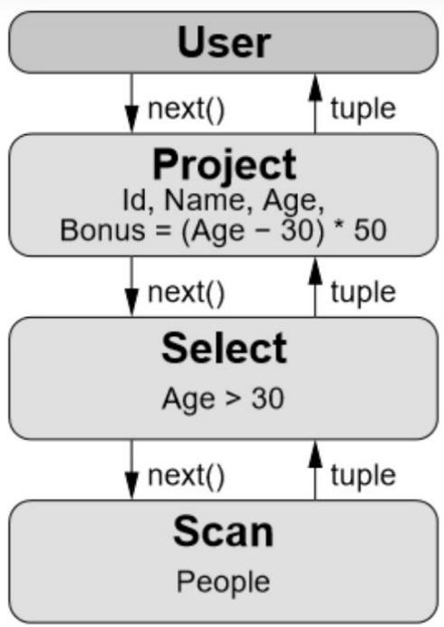


图 2.火山模型举例


火山模型将 sql 语句解析为各个层次的层，其中指令通过 next()函数进行向 下调用，数据信息通过 tuple 向上传递。 

# 3.2MiniOB 火山模型实现过程：

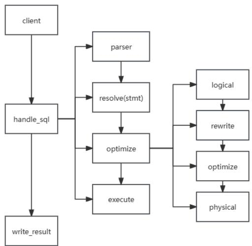


图3.MiniOB数据库火山模型建立流程


如图3所示，首先可以看到系统的原始结构图，这部分是主要的功能实现部 分。 

parser主要是词法语法分析部分。 

resolve(stmt)部分主要是预处理部分，主要是根据词法语法分析出的信息来调 

节系统的功能。 

optimize 部分分为四个部分，这四个部分就是构建火山模型的部分： 

logical 主要是构建根据预处理部分代码构建逻辑算子的部分。 

Rewrite是重写的部分，系统中没要求。 

Optimize是优化部分，系统中也没要求。 

Physical 是物理算子构建的部分，要求根据前面的逻辑算子来构建物理算子。 

Execute部分主要是完成一些基本的非算子功能。在后面重构的时候，所有的 功能都可以用算子来实现，所以 execute部分最后也基本上没有功能。 

在write_result 中open 和close部分函数是算子的基本功能函数，我们在构建 号算子之后，只需要通过调用 open和 close函数来实现火山模型的自上而下信息 传到，以及自下而上的信息处理的过程。最后将实现的信息传送到窗口即可。 

# 3.3 算子介绍[2]

SQL 算子可以理解为 SQL 语句执行过程中各个步骤的具体动作。 

SQL 语句的具体执行过程，可以根据 SQL语句的不同分成不同的执行步骤， 每个步骤中通常都会包含一个或多个 SQL算子。 

```sql
SELECT
    ProductID, SUM(Amount) TotalAmount
FROM
    OrderItem i, Order o
WHERE
    i.OrderID = o.OrderID
    AND o.OrderDate >= '2022-03-01'
Group By
    ProductID
Having
    SUM(Amount) > 1000
Order By
    TotalAmount DESC, ProductID
Limit 10 ; 
```


图 4.sql 语句分层


如图 4 所示，其中的 SELECT、SUM、FROM、WHERE、Group By、Having、 Order By、Limit 都是 SQL 算子。 

SQL 语句中 SQL 算子的执行顺序与语句本身及优化器的优化结果有关，具 体优先级关系如图 5所示。 

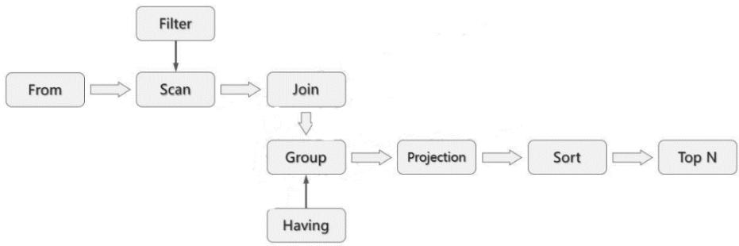


图 5.算子优先级过程


# 三.课程设计主要内容

本次课程设计基于 MiniOB 一共包含 25 道题目，具体内容涉及表的创建和 删除，数据创建和删除，基本的四则运算，视图的建立，多组数据的插入，复制 表等功能。 

# 1.题目及其基本思路

# 1.1basic

# 1.题目描述：

MiniOB 本身具有的一些基本功能。比如创建表、创建索引、查询数据、 查看表结构等。 

# 2.提示：

Basic 不需要修改代码就可以通过，所以 basic 提交成功主要是带领同学 完成基本的数据提交，即创建仓库以及提交代码的过程。 

# 3. 原题及提交入口链接：

```txt
https://open.oceanbase.com/train/TopicDetails?questionId=600004&subQesitonId=800004&subQuestionName=basic 
```

# 1.2 date

# 1.题目描述：

在现有功能上实现日期类型字段。 

当前已经支持了 int、char、float 类型，在此基础上实现 date类型的字段。 date 测试可能超过 2038 年 2 月，也可能小于 1970 年 1 月 1 号。注意处 理非法的 date输入，需要返回 FAILURE。 

这道题目需要从词法解析开始，一直调整代码到执行阶段，还需要考虑 DATE 类型数据的存储。 

注意： 

- 需要考虑 date字段作为索引时的处理，以及如何比较大小; 

- 这里没有限制日期的范围，需要处理溢出的情况。 

- 需要考虑闰年。 

# 2.提示：

Date题目主要是带领同学完成一个基本的数据类型的创建，是从词法语 法到预处理再到数据展示部分的所有的代码。Date 题目的难点是忘记了 对索引部分数据比较的处理。从而在后续提交的过程中发现只要有索引 参与的题目就会出现问题。 

3.原题及提交入口链接： 

https://open.oceanbase.com/train/TopicDetails?questionId=600004&subQesit onId=800005&subQuestionName=date 

# 1.3 drop-table

1.题目描述： 

实现删除表(drop table)，清除表相关的资源。 

当前 MiniOB 支持建表与创建索引，但是没有删除表的功能。 

在实现此功能时，除了要删除所有与表关联的数据，不仅包括磁盘中的 文件，还包括内存中的索引等数据。 

删除表的语句为 `drop table table-name` 

2.提示： 

删除表的题目需要对表进行删除，同时在表数据存在的结构存储在 db中， 那么对表的操作主要是在 db.h 中执行，首先需要添加 execute 文件夹中 添加删除表的执行函数，然后调用 db 的执行函数，最后在 db 结构中调 用表的 destory 函数。 

3.原题及提交入口链接： 

https://open.oceanbase.com/train/TopicDetails?questionId=600004&subQesit onId=800006&subQuestionName=drop-table 

# 1.4 update

1.题目描述： 

实现更新行数据的功能。 

当前实现 update 单个字段即可。现在 MiniOB 具有 insert 和 delete 功能， 在此基础上实现更新功能。可以参考 insert_record 和 delete_record 的实 现。目前仅能支持单字段 update的语法解析，但是不能执行。需要考虑 带条件查询的更新，和不带条件的更新，同时需要考虑带索引时的更新。 

2.提示： 

更新数据的功能是原结构没有实现的，但是在原结构实现了 insert 和 delete 的功能。那么我们考虑对更新的数据先进行删除然后再添加的操 作，从而最终完成相关功能。 

# 3.原题及提交入口链接：

```txt
https://open.oceanbase.com/train/TopicDetails?questionId=600004&subQesitonId=800007&subQuestionName=update 
```

# 1.5 aggregation-func

# 1.题目描述：

实现聚合函数 max/min/count/avg/sum。 

聚合函数会遍历所有相关的行数据做相关的统计，并输出结果。 

可能出现如 `select id, count(age) from t;` 这样的聚合和单个字段混合的 测试语句，返回 FAILURE。 

当前题目是简单题目，所以测试用例中不会包含一些比较复杂的处理， 比如表达式。但是有些数据类型会有隐式转换，比如 avg 计算整数类型 时，结果会是浮点数。 

注意处理语义处理时的异常场景，比如: 

查询不存在的字段； 

查询空字段； 

# 2.提示：

聚合函数功能的实现再简单题中，主要是由于聚合函数在简单题目中主 要是需求不高，只是部分简单单一的功能实现。但是这道题我们也会初 次遇到系统的火山模型，也即是算子的使用，这部分书写起来会很麻烦， 但是同学在初次尝试的时候，可以考虑直接将聚合函数部分直接写成算 子部分来通过相关的部分。如果同学要完成后续相对较难的题目，聚合 函数需要将其抽象成 expression。（我们比赛的时候就是 expression 放在 太后面，导致代码重构不及时）。 

# 3.原题及提交入口链接：

```txt
https://open.oceanbase.com/train/TopicDetails?questionId=600004&subQesitonId=800008&subQuestionName=aggregation-func 
```

# 1.6 like

# 1.题目描述：

like 操作符是数据库中字符串查找非常常用的功能能，用于在 WHERE 子句中搜索符合一定格式的字段。 

当前MiniOB中已经有条件查询的能力，需要扩展like相关的语法解析、 查询匹配功能。 

'%'用于匹配零个到多个任意字符（英文单引号“'”除外），'_'用于匹配一个 任意字符（英文单引号“'”除外）。 

当前只需要考虑 char 类型的字段即可（当前 MiniOB 支持 int, float 和 char 类型字段）。 

# 2.提示：

Like 题目主要是完成在 select 语句中完成 where 中的搜索部分，需要在 词法语法中添加 like关键词，由于需要匹配的方式比较简单，只是完成% 和_两种匹配方式，在算子阶段，将 like功能进行实现，并加入到已有的 xxx 算子。 

# 3.原题及提交入口链接：

https://open.oceanbase.com/train/TopicDetails?questionId=600004&subQesit onId=800009&subQuestionName=like 

# 1.7 join-tables

# 1.题目描述：

实现 INNER JOIN 功能，需要支持 join 多张表。 

当前已经支持多表查询的功能，这里主要工作是语法扩展，并考虑数据 量比较大时如何处理。 

注意带有多条 on 条件的 join 操作。 

# 2.提示：

词法和语法解析阶段，需要处理对 join 语句的识别。难点在于考虑到可 能出现的多层嵌套 join。这里一种较好的方式是统一整合成 expression 类 处理，最终形成树结构，保持原有的连接运算次序。（转化成 expression， 也大大简化了对于后续的 sub_query等问题的处理）。查询陈述阶段（stmt 类）和算计阶段，同样的，也要保持 expression 类形成的树结构。算法优 化阶段，原算法时间复杂度是 O(n2)，通过增大缓存的方式，可以优化。 

# 3.原题及提交入口链接：

```txt
https://open.oceanbase.com/train/TopicDetails?questionId=600004&subQesitonId=800010&subQuestionName=join-tables 
```

# 1.8 simple-sub-query

# 1.题目描述：

简单子查询。此功能是对基础查询功能的一个扩充，使数据库 SQL的能 力更加丰富。 

这里需要支持的功能包括但不限于： 

- 支持简单的 IN(NOT IN)语句，不涉及基本类型转换。注意 NOT IN 语句面对NULL 时的特殊性。 

- 支持简单的 EXISTS(NOT EXISTS)语句。 

- 支持与子查询结果做比较运算。 注意子查询结果为多行的情况。 

- 支持子查询中带聚合函数。 

- 子查询中不会与主查询做关联。这也是简单子查询区分于复杂子查 询的地方。 

- 表达式中可能存在不同类型值比较。 

# 2.提示：

词法和语法解析阶段，需要处理对子查询语句的识别，主要是 in和exists 关键词。这里建议同样将子查询整合成 expression 类。查询陈述阶段（stmt 类）和算子阶段，同样的，也要保持 expression 类形成的树结构。注意 NULL、唯一查询结果与多查询结果的不同处理，他们支持的运算并不相 同。例如单查询结果对多查询结果支持 in语句，而对单查询结果则要报 错。这里有很多细节。 

# 3.原题及提交入口链接：

```txt
https://open.oceanbase.com/train/TopicDetails?questionId=600004&subQesitonId=800015&subQuestionName=simple-sub-query 
```

# 1.9 function

# 1.题目描述：

实现一些常见的函数，包括 length、round 和 date_format。 

函数是 SQL中常见功能之一。这些函数除了用在查询字段上，还可能会 

出现在条件语句中，作为查询数据过滤条件之一。 

为了简化，仅考虑上述三种函数即可，其中 length 只考虑char类型，round 只考虑 float 类型，date_format 只考虑date类型，遇到其他的数据类型返 回 FAILURE 即可 

2.提示： 

给题目类似于 like的处理方式，添加功能即可 

3.原题及提交入口链接： 

```txt
https://open.oceanbase.com/train/TopicDetails?questionId=600004&subQesitonId=800016&subQuestionName=function 
```

# 1.10 multi-index

1.题目描述： 

多字段索引功能。即一个索引中同时关联了多个字段。比如 `CREATE INDEX i_1_12 ON multi_index(col1,col2);`。 

此功能除了需要修改语法分析，还需要调整 B+树相关的实现，帮助同学 们增加 B+树数据存储知识的理解。 

2.提示： 

多重索引的题目主要是要求同学对多重索引的理解，这里主要是需要对 B+树的修改，首先需要将 index_meta 修改，将其修改为多重索引形式， 原始为单一索引。然后需要对深层 bplus_tree 中 AttrComparator 的比较进 行修改，因为原来的比较是通过单一索引的比较，现在需要修改为多重 索引修改。 

3.原题及提交入口链接： 

```txt
https://open.oceanbase.com/train/TopicDetails?questionId=600004&subQesitonId=800013&subQuestionName=multi-index 
```

# 1.11 unique

1.题目描述： 

实现唯一索引功能。 

唯一索引是指一个索引上的数据都不是重复的。支持使用简单的 SQL创 建索引：`create unique index`。 

注意：需要支持多列的唯一索引。为了简化场景，不考虑在已有重复数 

据的列上建立唯一索引的情况。 

需要考虑数据插入、数据更新等场景。此功能主要涉及到 B+树与语法解 析方面的模块。 

# 2.提示：

这道题的目的是完成唯一索引的建立以及比较，我们采用的方式也是在 插入的数据的时候，进行索引数据的比较，当发现在添加索引的时候， 由于索引添加是需要进行排序的，处理的方法是传入一个引用参数，当 发现了相同的数据，就置为 true，最后返回数据的时候，判断索引类型是 unique，当时就直接判断插入失败，然后对 table 插入的情况进行回溯。 

# 3.原题及提交入口链接：

```txt
https://open.oceanbase.com/train/TopicDetails?questionId=600004&subQesitonId=800012&subQuestionName=unique 
```

# 1.12 null

# 1.题目描述：

NULL 是数据库的一个基本功能。 

表字段可以有 NULL属性，表示此字段是否允许为 NULL值。NULL 在 做数值运算、逻辑比较时，都有特殊的含义，同时在做聚合运算(count/avg 等）都需要做不同的处理。与 2022年的赛题不同，我们不再使用 nullable 关键字，而与常见的数据库保持一致，使用 NULL 关键字，不区分大小 写。比如 `create table t(id int null, name char not null);`，其中字段`id` 可 以为 NULL 值，而 `name`字段不允许为 NULL 值。 

注意： 

-NULL 与任何数值比较，结果都是 false。 

-NULL 用例非常基础，它出现在许多其它用例中。 

# 2.提示：

Null 的处理主要的问题在于数据的处理方式，由于数据 record 数据都可 以为 null 数据，所以我们需要考虑对原始存储数据进行修改，同时在表 格属性层级进行判断 null 可用性，这部分我们是直接在 field_meta 添加 是否可以为 nullable 参数来表示该属性是否可以为 null。同时我们在 record 数据部分添加了一个位示图 bitmap 来表示对应数据位置是否为 null。其中每一位表示的对应数据是否是 null。 


Record:


<table><tr><td>head</td><td>data1</td><td>data2</td><td>data3</td><td>...</td><td>bitmap</td></tr></table>


Table_schema:


<table><tr><td>sys_fields</td><td>FieldMeta1</td><td>FieldMeta2</td><td>FieldMeta3</td><td>...</td><td>bitmap_Field Meta</td></tr></table>


图 6.存储数据结构


# 3.原题及提交入口链接：

```txt
https://open.oceanbase.com/train/TopicDetails?questionId=600004&subQesitonId=800014&subQuestionName=null 
```

# 1.13 update-select

# 1.题目描述：

更新查询选中的行数据。 

此功能作为基础 update 功能的扩展，需要实现复杂查询语句基础上的更 新操作，使 update功能更加完善。 

功能描述：更新字段的值为通过 SELECT子查询得到的结果。子查询可 能是普通的查询，也可能会带有聚合函数。 

# 2.提示：

这个题目其实就是子查询部分的扩展，同时添加了多组数据的添加，需 要对原有的 update 方法进行修改，让其满足多组数据的 update，然后由 于算子火山模型结构的使用，其实 update不需要考虑下层数据的处理方 式，只需要面对多组数据到来的时候，完成必要的数据信息。然后这里 需要完成 update数据失败之后的多组数据的回溯问题即可。 

在完成 update的时候，发现也可以顺带完成 update-mvcc题目。 

# 3.原题及提交入口链接：

```html
https://open.oceanbase.com/train/TopicDetails?questionId=600004&subQesitonId=800011&subQuestionName=update-select 
```

# 1.14 expression

# 1.题目描述：

实现表达式功能。 

各种表达式运算是 SQL 的基础，有了表达式，才能使用 SQL 描述丰富 

的应用场景。 

这里的表达式仅考虑算数表达式，可以参考现有实现的 calc 语句，可以 参考 表达式解析 ，在SELECT 语句中实现。 

如果有些表达式运算结果有疑问，可以在 MySQL 中执行相应的 SQL， 然后参考 MySQL的执行即可。比如一个数字除以 0，应该按照 NULL类 型的数字来处理。 

当然为了简化，这里只有数字类型的运算。 

2.提示： 

可以优先做此题，否则会发现系统结构会变得尤其冗杂，对于前面的聚 合、子查询、cal 计算、alais 都可以通过 expression 抽象出来来解决冗杂 的问题。 

对于这道题的建议是先做，然后在其他题目的基础上在往上面添加其他 的解题思路。 

3.原题及提交入口链接： 

```txt
https://open.oceanbase.com/train/TopicDetails?questionId=600004&subQesitonId=800018&subQuestionName=expression 
```

# 1.15 alias

1.题目描述： 

实现字段、表别名的功能。 

别名功能看起来不是数据库的必备功能，但是它可以极大地方便我们使 用。比如美化或简化数据结构的输出、优化查询语句的编写。 

表和列可以临时取别名，在打印结果时表和字段都打印别名（如果有）。 在查询时能够使用表的别名访问表的字段。两个表的别名在同一层查询 中不能重复，子查询里面和外面的表的别名可以重复。列的别名只需要 支持查询结果显示，不需要考虑使用别名进行运算和比较，也不考虑列 的别名重复。 

2.提示： 

这一题为实现别名功能，其关键在于两点：1、在语法词法解析处支持多 种别名语法，包括别名/完整名组合的情况，子查询中存在别名的情况等； 

2、实现别名-完整名的映射或替换，保证执行计划中每一个查询算子（如 TableScan）都能够获取完整的待查表名/属性名，从而成功查询到数据记 录。 

# 3.原题及提交入口链接：

```typescript
https://open.oceanbase.com/train/TopicDetails?questionId=600004&subQesitonId=800020&subQuestionName=alias 
```

# 1.16 text

# 1.题目描述：

实现文本字段。 

在数据库中，我们会有存储超大数据的需求，比如在数据库中存放网页。 这里考虑使用 text 字段，存放超大数据。参考 mysql 的实现，text 字段的 最大长度为 65535个字节，插入超出这个长度的数据就报错。 

这里除了需要实现语法解析，还需要考虑如何在存储引擎中存放超长字 段，扩展 record_manager，以支持超过一页的数据。 

注意：这里接受的最大长度与 2022年不同。 

# 2.提示：

首先本题要求增加一种新的字段类型 text（字段类型见 sql/parser/value.h）， 题中要求 text 能够最大存储 65535 个字节的数据。而 MiniOB 初版存储 引擎单页默认大小 8184，是没有足够的空间存储超长字段的。同时，该 题还需要理解 MiniOB 中单条 record 及其中各字段的存储逻辑，并进行 扩展，从而支持 text字段。 

# 3.原题及提交入口链接：

```gitattributes
https://open.oceanbase.com/train/TopicDetails?questionId=600004&subQesitonId=800017&subQuestionName=text 
```

# 1.17 order-by

# 1.题目描述：

实现排序功能。 

排序也是数据库的一个基本功能，就是将查询的结果按照指定的字段和 顺序进行排序。 

# 2.提示：

Order by 是典型的阻塞算子，其需要遍历其下级算子获取所有记录数据， 然后根据排序字段进行排序，最后向上级算子返回排序后的数据。在 MiniOB 中，实现Order by功能需要实现对应的逻辑算子与物理算子（见 sql/operator 中的实现），同时在生成执行计划时添加 Order by 算子的正 确解析。由于 MiniOB 采用的是火山模型，Order by 算子需要在执行时 首先调用其下级算子的 next()获取所有数据，并在缓冲区中排序，之后实 现 next()接口向上级算子逐条返回已排序数据。具体排序技术可根据自 己的实现方式自由选择，例如对于 n 个排序字段，可以根据排序字段重 要性倒序做 n轮稳定排序，即可获得最终结果。 

# 3.原题及提交入口链接：

```txt
https://open.oceanbase.com/train/TopicDetails?questionId=600004&subQesitonId=800019&subQuestionName=order-by 
```

# 1.18 group-by

# 1.题目描述：

实现数据分组功能。 

分组功能也是数据库的基本功能之一，目的是为了方便用户查询数据结 果，按照一定条件进行分组，方便分析数据。 

按照一个或多个字段对查询结果分组，group by 中的聚合函数不要求支 持表达式。 

需要支持 having 子句，因为聚合函数不能出现在 where后面，所以增加 having 子句用于筛选分组后的数据。不过 having 只和聚合函数一起出现。 

注意需要考虑分组字段为 null 的情况。 

# 2.提示：

分组的方式和 order 的方法有点相似，都是在火山模型中添加相关的算 子来实现的，首先在 group算子下层先前序的 select 的算子进行计算，从 而获得得到的数据信息，然后对下层得到的数据信息进行按照要求分组 即可。这道题还要求 having 语句的实现，having 在 sql 语句的顺序是最 后面的，所以 having 算子的实现，我们只需要将 having 算子放置在火山 模型最外面，和 predict 算子实现的思路是一致的。 

# 3.原题及提交入口链接：

```txt
https://open.oceanbase.com/train/TopicDetails?questionId=600004&subQesitonId=800022&subQuestionName=group-by 
```

# 1.19 create view

# 1.题目描述：

实现视图功能。 

视图是数据库的基本功能之一。视图可以极大地方便数据库的使用。 

视图，顾名思义，就是一个能够自动执行查询语句的虚拟表。 

不过视图功能也非常复杂，需要考虑视图更新时如果更新实体表。如果 视图对应了单张表，并且没有虚拟字段，更新视图，即更新了实体表。 如果实体表中某些字段不在视图中，那此字段的结果应该是 NULL或默 认值。如果视图中包含虚拟字段，比如通过聚合查询的结果，或者视图 关联了多张表，他的更新规则就变得复杂起来。在这些场景中，同学们 可以参考 MySQL的实现方案。 

# 2.提示：

对于视图这道题，我们在比赛后想到了一个思路，就是对 view的语句进 行存储在 db数据中，当需要对视图信息进行查看的时候直接调用对应的 sql 语句，那么对于视图的修改，我们的思路就是在底层 record算子阶段 直接对数据进行修改，从而避免视图数据存储和修改。 

# 3.原题及提交入口链接：

```txt
https://open.oceanbase.com/train/TopicDetails?questionId=600004&subQesitonId=800023&subQuestionName=create-view 
```

# 1.20 create-table-select

# 1.题目描述：

复制表。 

复制表并不是数据库中常用的功能，但是可以极大的方便我们测试与运 维。其基本功能是在建表时通过`select`语句，直接创建出一张新的表， 新表的结构通过 select 语句推导出来，数据会直接导入到新表中。 

# 2.提示：

这道题的思路和子查询的思路相似，先是进行基本的select语句的查询， 然后将数据信息存储下来，然后在 pro 算子上面加上 create table 算子即 可，然后将数据加入到表格即可。这里的大致方法和 update-select 题目 的方法基本一直，都是对多组数据进行操作，只是这题要求对多组添加 到一个表格，并且在添加之前还需要创建表格。 

# 3.原题及提交入口链接：

```txt
https://open.oceanbase.com/train/TopicDetails?questionId=600004&subQesitonId=800024&subQuestionName=create-table-select 
```

# 1.21 complex-sub-query

# 1.题目描述：

实现复杂子查询功能。 

复杂子查询是简单子查询的升级。与其最大的不同就在于子查询中会跟 复查询联动。注意需要考虑查询条件中带有聚合函数的情况。 

# 2.提示：

在复杂子查询中，要注意子查询和复查询的联动。也就是说，子查询作 为单独的查询语句运行时，是要报错的。 

一个简单的处理方法是，利用 static关键字，加入静态局部变量，对复查 询中行指针进行维护。子查询在确认需要联动查询之后，通过维护的复 查询结果完成计算。 

# 3.原题及提交入口链接：

```txt
https://open.oceanbase.com/train/TopicDetails?questionId=600004&subQesitonId=800021&subQuestionName=complex-sub-query 
```

# 1.22 update-mvcc

# 1.题目描述：

实现MVCC 中的更新功能。 

事务是数据库的基本功能，此功能希望同学们补充 MVCC（多版本并发 控制）的 update 功能。这里主要考察不同连接同时操作数据库表时的问题。 

事务管理在 MiniOB 并没有完善的实现，比如原子性提交、持久化、垃 圾回收等。如果有兴趣的同学，可以给 MiniOB 提交 PR。 

注意： 

- 测试多连接，但不会测试多并发（即程序是串行执行的）； 

- 启动 observer 程序时，需要增加`-t mvcc`参数 ，比如 `./bin/observer -f ../etc/observer.ini -s miniob.sock -t mvcc` 

- 测试过程中如果遇到官方代码自有的 BUG，请修复它，也欢迎提 PR。 

# 2.提示：

本题直接在 update写一个错误回溯处理即可。 

3.原题及提交入口链接： 

https://open.oceanbase.com/train/TopicDetails?questionId=600004&subQesit 

onId=800025&subQuestionName=update-mvcc 

# 1.23 big-query

1.题目描述： 

实现大数据量的更新与查询功能。 

当前要求实现的大部分功能都是 SQL相关的小数据量。这里考察大数据 量的插入、更新与查询能力，同学们可能需要优化存储引擎、查询内存 的使用。 

这里会测试 1到3张表，每张表有几千条数据。在插入数据工作完成后， 会抽取一定量的数据做更新操作，然后进行数据抽查。 

2.提示： 

按照前面正常题目做，这题数据量不大，可以直接通过。 

3.原题及提交入口链接： 

https://open.oceanbase.com/train/TopicDetails?questionId=600004&subQesit onId=800026&subQuestionName=big-query 

# 1.24 big-write

1.题目描述： 

实现大量数据的增删改查功能。 

与big-query类似，这里考察大量数据的增删改查。同学们需要优化存储 引擎、内存使用等，并确保程序稳定可靠。 

对提前创建完成的表，做随机的增删改操作，然后通过查询校验数据是 否有问题。 

2.提示： 

本题和 big-query 一样，完成基本功能即可通过。 

3.原题及提交入口链接： 

https://open.oceanbase.com/train/TopicDetails?questionId=600004&subQesit 

onId=800027&subQuestionName=big-write 

# 1.25 big-order-by

# 1.题目描述：

大数据量的排序功能。 

在内存有限的情况下，实现大数据量的排序，需要优化内存使用。注意， 测试数据和数据量具备一定的随机性。 

注意：order by 的查询语句，需要在大概 3 分钟内完成，并且第一条数 据输出要在 10秒以内（会有一定误差）。 

有三四张表，每张表的数据量在 20左右，所有表在一起做笛卡尔积查询， 并且对每个字段都会做 order by 排序。通常这么大的数据量不能在短时 间内排序完成，所以需要考虑优化数据的存放和拉取。 

# 2.提示：

本题和前面的 order-by 的处理方法一致，如果不采用 O(n^2)的排序方法， 即可直接通过。 

# 3.原题及提交入口链接：

https://open.oceanbase.com/train/TopicDetails?questionId=600004&subQesit onId=800028&subQuestionName=big-order-by 

# 四.开发环境搭建

这里主要介绍两种代码环境，1）官方提供的 GitPod，2）本地搭建的 docker 环境。 

# 1. GitPod 介绍

GitPod 是一个能让我们在任何地方都能方便开发自己代码的云平台。在开发 时，GitPod 会提供一个虚拟机一样的开发环境，开发平台是 Linux，并且GitPod 可以直接打开 GitHub 项目，支持很多 IDE，比如 Visual Studio Code、Clion、VIM 等。 

# 1.1 创建自己的 GitHub 项目

在开发 MiniOB 之前，应该先在 GitHub 上将 MiniOB 放在自己的私有仓库 中。为了方便演示，我这里直接使用 fork的方式，在自己的个人仓库中创建一个 共有(public)仓库。 

在浏览器中打开 MiniOB，然后 fork仓库。fork 后就会在自己的个人名下有 一个 MiniOB 仓库代码。 

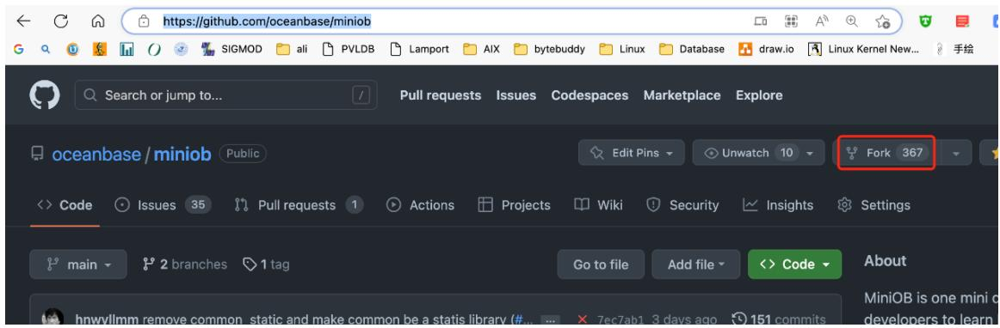


图 7.创建 MiniOB 仓库


# 1.2 在 GitPod 上打开自己的项目

GitPod 链接：https://www.gitpod.io/ 

如果是第一次使用，需要输入一些额外的信息，按照 GitPod 的引导来走就 行，最终会引导你打开你的项目。 


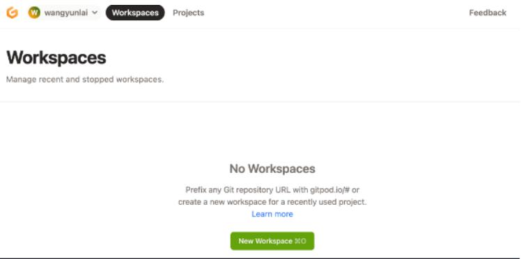


图 8.Gitpod 界面


选择自己的代码项目，并且使用 vscode浏览器版本，容器规格也选择最小的 （最小的规格对 miniob 来说已经非常充足），连接github 仓库。 

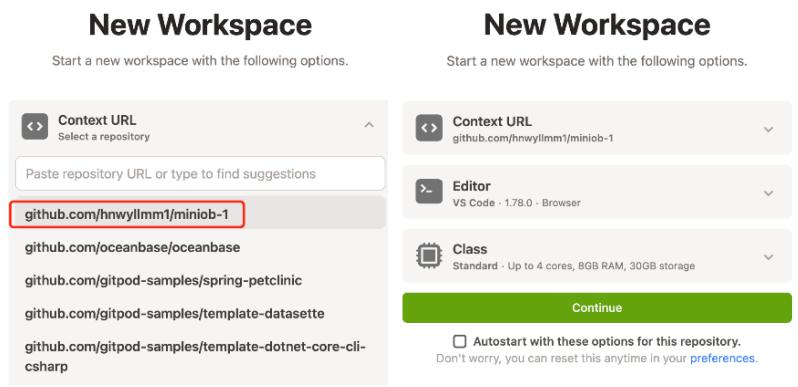


图 9.Gitpod 连接 github 仓库


# 1.3 代码构建

环境初始化 因为 MiniOB 当前已经将.vscode 文件加入到项目中，所以可以 直接使用当前已有的一些命令(task)来构建代码。 如果是一个全新的机器环境， 那么先要运行 init 任务。init 任务会在当前的机器上安装一些依赖，比如 google test、libevent 等。 

编译 miniob 初始化完成，可以运行 Build 任务，即可构建。 

这些构建方法，也可以通过命令行的方式手动执行。 

所有的任务都可以从这里找到入口。 

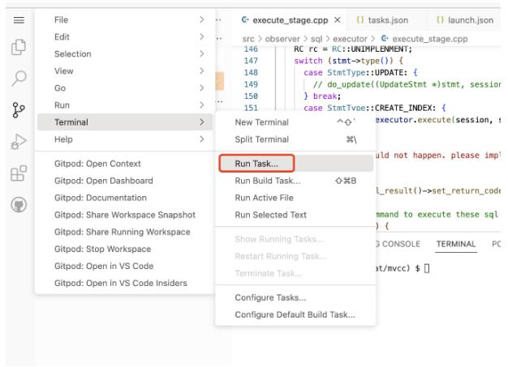


图 10.执行代码


运行 init 命令的入口。 

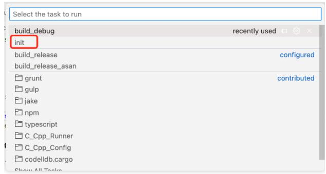


图 11.初始化代码


运行构建（编译）的入口。需要设置默认构建的任务，vscode才能运行。这 里已经设置过了。 

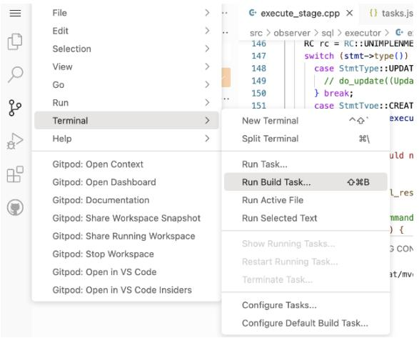


图 12.Gitpod 编译代码


构建（编译）时，会有一些输出，如果有编译错误，也可以直接使用鼠标 点击跳转到错误的地方。 

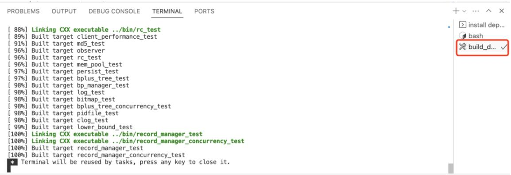


图 13.编译结果


WARNING: 不要在 gitpod 的终端上，执行 sh build.sh，而是执行 bash build.sh 或者直接运行 ./build.sh 

miniob 虽然是 cmake 功能，可以使用 vscode 带的 cmake 配置，但是 miniob 在编译时，会使用一些变量来控制编译什么版本，比如是否编译 UNITTEST，是否开启 ASAN等。因此这里使用 build.sh 脚本来简化项目的编 译命令。 

# 1.4 提交代码到仓库

作为一个 GitHub 项目，一个功能或者 BUG 开发完成后，需要将代码推送到 远程仓库。vscode 已经集成了 GitHub 和 git 插件，可以方便的进行操作。 

完成一个功能，就提交一次。这里输入 commit message 后直接提交即可。 

注意这里仅仅提交到了本地，如果要提交到 GitHub（远程仓库），需要执行” 推送“，即 git push。 

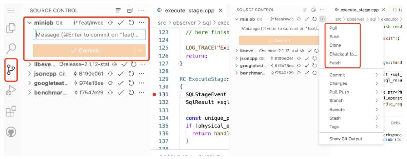


图14.将修改好的代码放到 github仓库


链接：https://oceanbase.github.io/miniob/dev-env/dev_by_gitpod.html


# 2.基于 Docker 的本地环境搭建介绍

这里主要介绍 docker环境下利用 vscode环境搭建。过程如下： 

# 2.1.下载 docker

https://www.docker.com/get-started/ 

# 2.2.获取 oceanbase/miniob 的 docker 环境

方法是在任意位置启动 终端(cmd 或者 powershell)，运行以下代码： 

# docker run --privileged -d --name=miniobtest oceanbase/miniob

其中 --name=miniobtest 这个“miniobtest”是自己容器的名字，可以自己改。 这个代码大概理解成从远程oceanbase/miniob拉取适合MiniOB的配置好的环境。 

这一步之后先把 docker 放一放，后面需要将本地文件与 docker 进行一个连 接，先不放代码以免产生误解。 

# 2.3.在 vscode 中使用 git 对官网 MiniOB 进行 clone ，在本地 创建一个代码仓库

# 2.3.1 准备工作：

下载 vscode https://code.visualstudio.com/ 

下载 git https://git-scm.com/ 

配置 vscode 设置 ,下载所需扩展插件：包括需要的 cpp、cmake、docker 等 

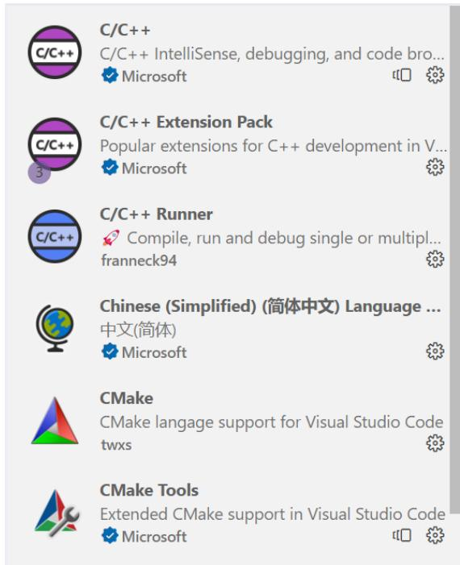


图15.编译所需扩展


Vscode 连接 docker 的扩展 

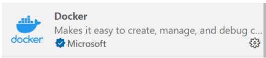


图 16.Docker 扩展


# 2.3.2 进入 vscode clone 代码

文件-打开文件夹，选取一个用于保存代码的文件夹，然后ctrl+shift+~ (快速 新建一个终端) (PS：Mac 系统 Command + J)； 

在终端里输入： 

git clone https://github.com/oceanbase/miniob.git 

如果 git 配置正确并且能成功连接到 github，您可以得到： 

```txt
PS E:\fortest> git clone https://github.com/oceanbase/miniob.git
Cloning into 'miniob'...
remote: Enumerating objects: 4354, done.
remote: Counting objects: 100% (1935/1935), done.
remote: Compressing objects: 100% (382/382), done.
Receiving objects: 100% (4354/4354), 25.34 MiB | 1014.00 KiB/s, done.d 2419
Resolving deltas: 100% (2849/2849), done. 
```


图 17.从 github 上 clone 下 MiniOB 基本代码


然后您可以进入得到的代码文件查看分支信息：例如 

ls --查看当前目录 

cd ‘文件名’ --进入 

<table><tr><td colspan="4">PS E:\fortest&gt; 1s</td></tr><tr><td colspan="4">目录: E:\fortest</td></tr><tr><td colspan="4">Mode LastWriteTime Length Name</td></tr><tr><td colspan="4">d---- 2023/10/16 21:46 miniob</td></tr><tr><td colspan="4">PS E:\fortest&gt; cd miniob
PS E:\fortest\miniob&gt; 1s</td></tr><tr><td colspan="4">目录: E:\fortest\miniob</td></tr><tr><td colspan="4">Mode LastWriteTime Length Name</td></tr><tr><td colspan="4">d---- 2023/10/16 21:46 .github
d---- 2023/10/16 21:46 .vscode
d---- 2023/10/16 21:46 benchmark
d---- 2023/10/16 21:46 cmake
d---- 2023/10/16 21:46 deps
d---- 2023/10/16 21:46 docker
d---- 2023/10/16 21:46 docs
d---- 2023/10/16 21:46 etc
d---- 2023/10/16 21:46 src
d---- 2023/10/16 21:46 test
d---- 2023/10/16 21:46 tools
d---- 2023/10/16 21:46 unittest
-a---- 2023/10/16 21:46 2563 .clang-format
-a---- 2023/10/16 21:46 358 .gitignore
-a---- 2023/10/16 21:46 433 .gitmodules
-a---- 2023/10/16 21:46 283 .gitpod.yml
-a---- 2023/10/16 21:46 3790 build.sh
-a---- 2023/10/16 21:46 4681 CMakeLists.txt
-a---- 2023/10/16 21:46 3304 CODE_OF_CONDUCT.md
-a---- 2023/10/16 21:46 4289 CONTRIBUTING.md
-a---- 2023/10/16 21:46 126451 Doxyfile
-a---- 2023/10/16 21:46 9288 License
-a---- 2023/10/16 21:46 6630 NOTICE
-a---- 2023/10/16 21:46 6729 README.md</td></tr><tr><td colspan="4">PS E:\fortest\miniob&gt;</td></tr></table>


图 18.查看文件


您可以输入 （要先进入 clone 得到的代码文件里面，才能读取到.git 文 件） 

```txt
git branch -a 
```

查看所有分支 

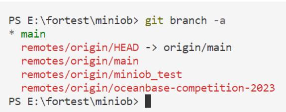


图 19.查看git仓库分支


# 2.4.将获取到的文件与 docker容器 映射连接

创建一个 container（映射方式） 

接下来我们进入 clone 得到的文件夹的上一层目录，在那打开终端（这是方 便后续代码的实现） 

您也可以用 cd 指令进入得到的文件夹的上一层目录 

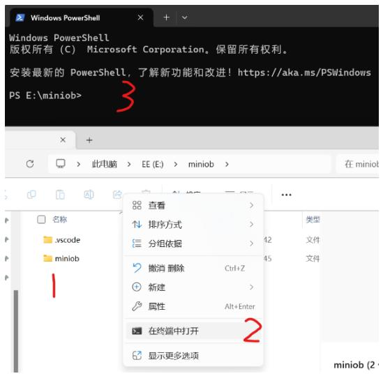


图 20.打开终端


然后输入 

docker run -d --name fortest --privileged -v $PWD/miniob:/root/miniob oceanbase/miniob 

分析如下： 

您提供的命令docker run用于运行具有特定选项和配置的 Docker 容器， 但它还指定要运行的映像。让我们分解一下命令： 

docker run：这是启动新 Docker 容器的基本命令。 

-d：此选项以分离模式运行容器，这意味着它在后台运行，允许您继续 使用终端。 

--name fortest：此选项指定容器的名称为“fortest”。 

--privileged：这是一个与安全相关的选项，可授予容器额外的权限，从而 有效地赋予其对主机系统的更高访问权限。使用时要小心，--privileged 因为 它可能会带来安全风险。 

-v $PWD/miniob:/root/miniob：此选项用于创建卷安装。它将主机系统上 的目录或文件映射到容器内的目录。在本例中，它将主机系统上 MiniOB 当 前工作目录 ( ) 中的目录映射到容器内的目录。这是向容器提供数据或配置 的常见方法。$PWD``/root/miniob 

oceanbase/miniob：指定要运行的 Docker 映像。镜像“oceanbase/miniob” 用于创建容器。如果您的系统上尚未提供该映像，Docker 将尝试从 Docker Hub 中提取该映像。 

因此，总体命令是以分离模式运行名为“fortest”的 Docker 容器，授予其 提升的权限，将目录 MiniOB 从主机系统安装到/root/miniob 容器内的目录， 并使用“oceanbase/miniob”映像作为容器。此命令对于运行基于具有特定配置 的“oceanbase/miniob”映像的容器非常有用。 


得到的结果如图


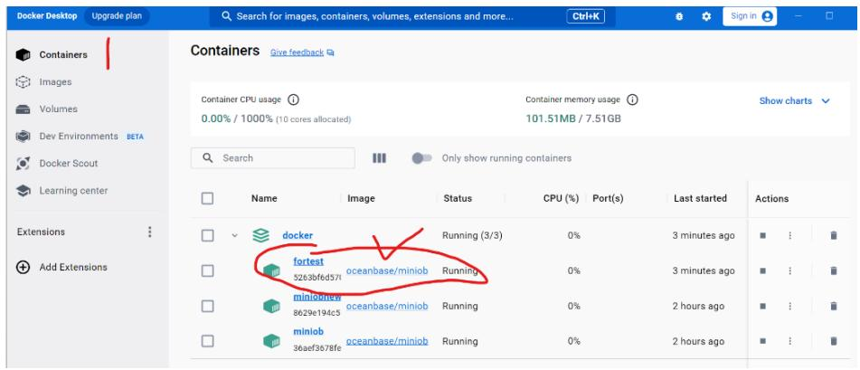


图 21.docker 启动画面


# 2.5.在 vscode 中启动 docker

先打开 docker软件（每次重启电脑后都需要做） 

打开 vscode，在左侧边栏找到下载好的 docker 插件 

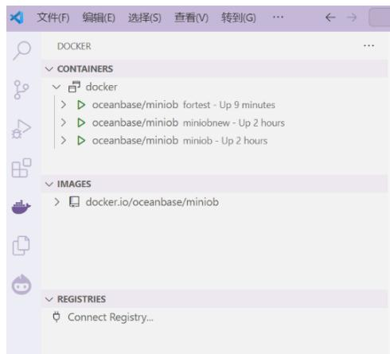


图 22.vscode 查看 docker


然后选中您刚才用以下代码生成的容器，如果是初次生成，您可能只会显示 一个容器 

docker run -d --name fortest --privileged -v $PWD/miniob:/root/miniob oceanbase/miniob 

右键选中容器然后 attach shell 

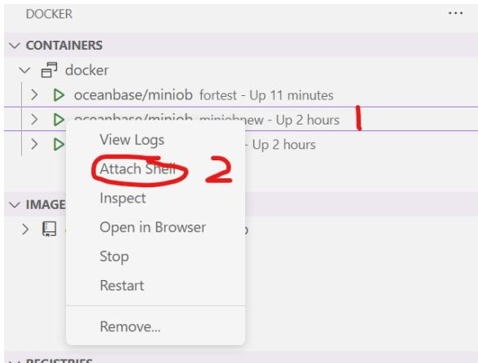


图 23.vscode 连接 docker


然后在打开的终端中就可以编译 MiniOB 了！（注意，一开始是不会有 build 和 build_debug 文件的,这两个是通过运行 bash.sh 生成的） 

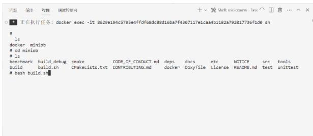


图 24.尝试编译 MiniOB


综合运用以下代码运行 build.sh 文件 

以监听 TCP 端口的方式启动服务端程序 

```shell
./bin/observer -f ../etc/observer.ini -p 6789 
```

这会以监听 6789端口的方式启动服务端程序。 启动客户端程序： 

```txt
./bin/obclient -p 6789 
```

以上 docker 安装流程主要是来自 https://oceanbase.github.io/miniob/devenv/how_to_dev_in_docker_container_by_vscode_on_windows.html，如需要使用 官方所配置的 GitPod以及服务器远程环境搭建，可参考其他该网站其他教程。 同时存在过程不清楚明白的可以通过 oceanbase 社区 https://ask.oceanbase.com/进 行问题讨论。 

# 五.提交测试流程

代码测试需要在网站 https://open.oceanbase.com/train 进行提交测试 

代码提交需要在 github 或者 gitee上创建自己的仓库，然后将本地的 MiniOB 仓库代码更新到远端仓库，然后在提交的时候直接通过仓库代码即可。 

这里以 gitee 为例： 

# 1.首先在 gitee 上面创建 MiniOB 的仓库

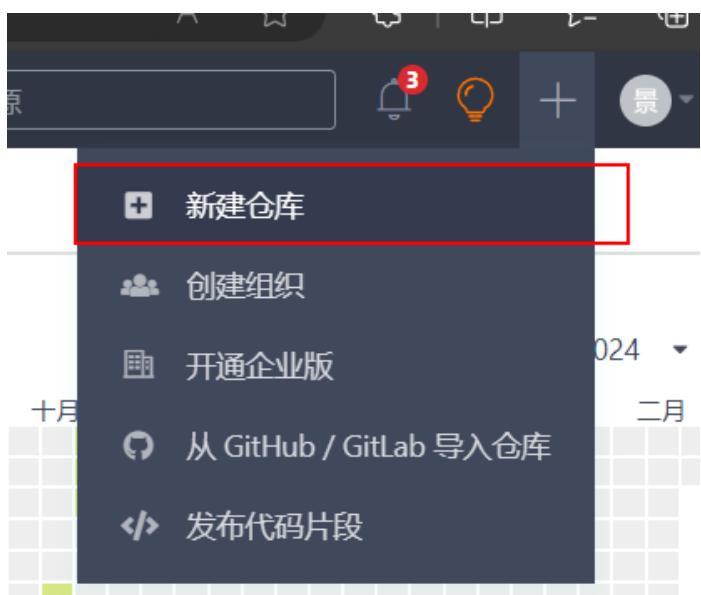


图 25.gitee 上新建仓库


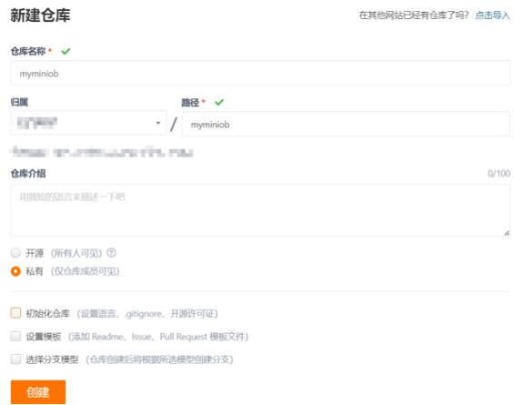


图 26.新建仓库的配置


# 2.将本地仓库更新到远端仓库

在本地 MiniOB 文件夹中右键打开 git。 

Git 为例： 

git push <远程主机名> <本地分支名>:<远程分支名> 

```txt
@LAPTOP-EI1S04TM MINGW64 /e/miniob (expression_huge_parser_Conflict)
$ git push https://gitee.com/jx2/110/myminiob.git 390390390 
```


图27.将本地仓库代码分支传送到远端仓库


在远端仓库就可以看见 

<table><tr><td>390390390</td><td>分支 1 标签 0</td><td>克隆/下载</td></tr><tr><td colspan="2">Q-ModifiedJ Update select_stmt.cpp ef7bc9c 4个月前</td><td>372 次提交</td></tr><tr><td>. github</td><td>Create codeql.yml (#265)</td><td>5个月前</td></tr><tr><td>. vscode</td><td>modify vscode file</td><td>4个月前</td></tr><tr><td>benchmark</td><td>unique-v7</td><td>4个月前</td></tr><tr><td>cmake</td><td>observer可以直接在控制台输入命令(#199)</td><td>8个月前</td></tr><tr><td>deps</td><td>null-v5</td><td>4个月前</td></tr><tr><td>docker</td><td>a lost try on sub_query</td><td>4个月前</td></tr><tr><td>docs</td><td>增加调试信息页面 (#284)</td><td>4个月前</td></tr><tr><td>etc</td><td>Remove stages (#208)</td><td>7个月前</td></tr><tr><td>src</td><td>Update select_stmt.cpp</td><td>4个月前</td></tr><tr><td>test</td><td>agg_fixed and fun id agg merge parser</td><td>4个月前</td></tr><tr><td>tools</td><td>observer可以直接在控制台输入命令(#199)</td><td>8个月前</td></tr><tr><td>unittest</td><td>null</td><td>4个月前</td></tr></table>


图 28.远端仓库显示


# 3.提交代码

首先需要将 oceanbase 的官方添加到观察者中： 

尔口口红 


观察者(1) 


oceanbase-ce-game-test 

观察者 

权限说明：私有仓库观察者不能操作代码，但可以下载代码，可以创建Wiki，Issue；公开仓库可以创建PullRequest等 

图29.添加ob官方观测者 

然后提交代码 

提交代码之前需要在 OB 官网创建账号用于测试 

提交网址：https://open.oceanbase.com/train?questionId=600004 

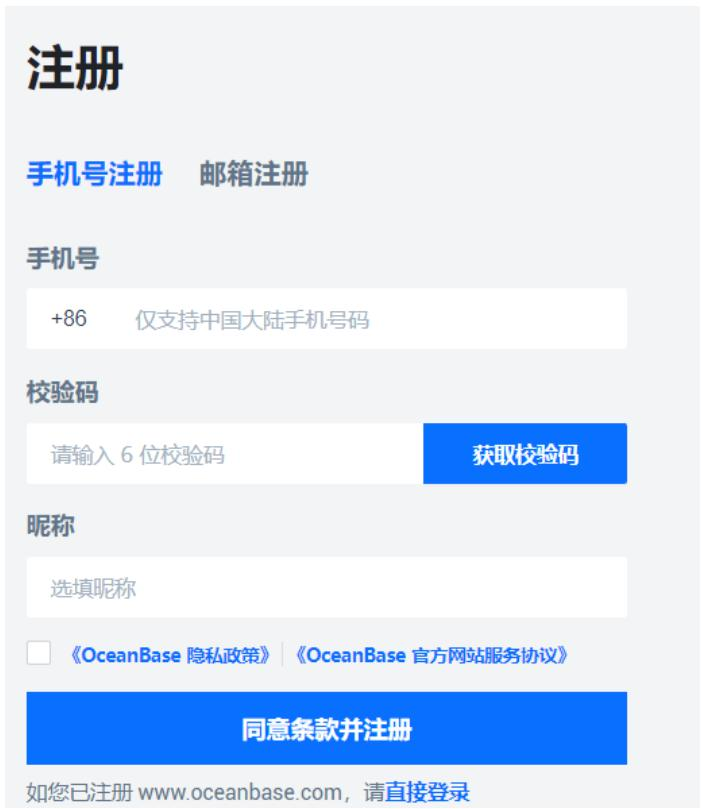


图 30.在官网注册账号


然后便可以直接在训练营进行提交了 

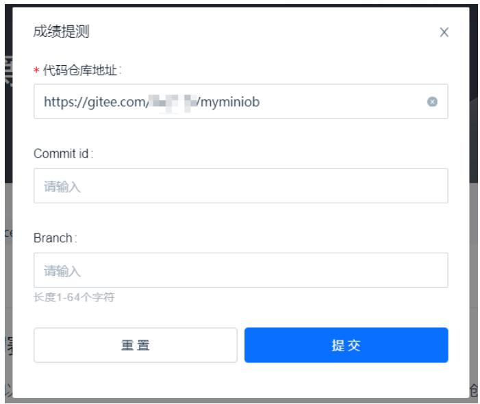


图 31.提交代码


就可以看到结果测试结果了： 


图 32.等待结果查看 

就可以等待测试结果了 

测试过程中是会对所有的测试题目都进行测试的。 

# 六．课程设计要求

根据数据库管理系统设计与实现的开发过程和结果，完成课程设计报告中，课程设计报 告主要内容如下： 

 （报告第 1页）封面：北京邮电大学课程设计报告 

按照封面规定的格式，填写小组成员信息和人员分工、课程设计内容（简介）。 

 课程设计的目的、内容 

 课程设计任务的整体介绍 

从数据库管理系统架构、实现功能及其相关概念、采用的开发平台等进行归纳总结， 并介绍总体的完成情况。 

 实现方案 

针对每一题目，详细阐述自己的设计方案、优化方法与具体实现，可以适当展示核 心代码 

 实践心得 

根据课程设计的完成过程，总结所学技术与心得 

 总结 

注意： 

 课程设计报告文档命名规则：班级_姓名 1_姓名2数据库课程设计报告 

 实验代码作为单独附件提交 

# 七．注意事项

1. 分组完成课程设计，每组不超过3 人。 

2. 课程设计文档应格式规范，内容完整。包括封面、目录、正文内容、案例图片、附录 等 

3. 课程设计完成后，各组提交设计文档、程序，并通过程序演示进行课程验收。 

# 4. 重点注意事项：

1） 提交文档的名称统一采取如下形式： 

班级_姓名 1_姓名 2 数据库课程设计报告.doc 

2） 文档必修包括封面，封面格式参见： 

课程设计报告封面(分组版) 

在封面栏目“课程设计内容”中，填写课程设计内容、组员分工。 

3） 不要照抄指导书中内容 

4） 将所有设计文档合并在一个 Word 文件中，图片插入文档中合适位置；所有程序 代码以附录形式单独放在一个文件中。 

5. 实验必须包括规定的25到题目的设计、优化与实现方案，如有缺失，扣分。 

6. 第 8周左右中期检查 

线上或线下验收 

各组应完成的实验内容不少于全部内容的 50%，保证课程设计进度 

7. 最终课程设计验收在第 15-16周，提前完成的组可提前预约验收 

8. 按时提交文档，并进行验收。验收前，文档发至：shaoyx@bupt.edu.cn 

验收时间、地点：待定，预计在第 15 或16 周进行验收。 

如果提前做完，可以提前预约验收。 


北京邮电大学课程设计报告


<table><tr><td>课程设计名称</td><td colspan="2">数据库系统原理课程设计</td><td>学院</td><td>计算机学院</td><td>指导教师</td><td></td></tr><tr><td>班级</td><td>班内序号</td><td colspan="2">学号</td><td>学生姓名</td><td colspan="2">成绩</td></tr><tr><td>2018211xxx</td><td></td><td colspan="2"></td><td>xxx</td><td colspan="2"></td></tr><tr><td>2017211xxx</td><td></td><td colspan="2"></td><td>xxx</td><td colspan="2"></td></tr><tr><td></td><td></td><td colspan="2"></td><td></td><td colspan="2"></td></tr><tr><td>课程设计内容</td><td colspan="6">简要介绍课程设计的主要内容,包括课程设计教学目的、基本内容、实验方法和团队分工等教学目的:内容方法:分工:</td></tr><tr><td>学生课程设计报告(附页)</td><td colspan="6"></td></tr><tr><td>课程设计成绩评定</td><td colspan="6">遵照实践教学大纲并根据以下四方面综合评定成绩:1、课程设计目的任务明确,选题符合教学要求,份量及难易程度2、团队分工是否恰当与合理3、综合运用所学知识,提高分析问题、解决问题及实践动手能力的效果4、是否认真、独立完成属于自己的课程设计内容,课程设计报告是否思路清晰、文字通顺、书写规范评语:成绩:指导教师签名:年 月 日</td></tr></table>


注：评语要体现每个学生的工作情况，可以加页 


实验验收表格


<table><tr><td colspan="2">班级</td><td colspan="2">姓名,学号,分工</td></tr><tr><td colspan="2"></td><td colspan="2"></td></tr><tr><td colspan="2">DB平台,开发语言</td><td colspan="2"></td></tr><tr><td colspan="4">完成情况及评分点</td></tr><tr><td colspan="3">实验内容及功能点</td><td>完成情况</td></tr><tr><td>文档内容(5分)</td><td colspan="2">1. 实验目的、内容、总体介绍及实验心得等(5分)</td><td></td></tr><tr><td rowspan="20">功能实现(90分)</td><td colspan="2">题目1: basic(2分)</td><td></td></tr><tr><td colspan="2">题目2: date (2分)</td><td></td></tr><tr><td colspan="2">题目3: drop-table (2分)</td><td></td></tr><tr><td colspan="2">题目4: update (2分)</td><td></td></tr><tr><td colspan="2">题目5: aggregation-func (3分)</td><td></td></tr><tr><td colspan="2">题目6: like (3分)</td><td></td></tr><tr><td colspan="2">题目7: join-tables (4分)</td><td></td></tr><tr><td colspan="2">题目8: simple-sub-query (4分)</td><td></td></tr><tr><td colspan="2">题目9: function (3分)</td><td></td></tr><tr><td colspan="2">题目10: multi-index (4分)</td><td></td></tr><tr><td colspan="2">题目11: unique (3分)</td><td></td></tr><tr><td colspan="2">题目12: null (3分)</td><td></td></tr><tr><td colspan="2">题目13: update-select (4分)</td><td></td></tr><tr><td colspan="2">题目14: expression (4分)</td><td></td></tr><tr><td colspan="2">题目15: alias (3分)</td><td></td></tr><tr><td colspan="2">题目16: text (3分)</td><td></td></tr><tr><td colspan="2">题目17: order-by (4分)</td><td></td></tr><tr><td colspan="2">题目18: group-by (4分)</td><td></td></tr><tr><td colspan="2">题目19: create-view (4分)</td><td></td></tr><tr><td colspan="2">题目20: create-table-select (4分)</td><td></td></tr><tr><td rowspan="5"></td><td>题目21: complex-sub-query (5分)</td><td colspan="2"></td></tr><tr><td>题目22:update-mvcc (5分)</td><td colspan="2"></td></tr><tr><td>题目23: big-query (5分)</td><td colspan="2"></td></tr><tr><td>题目24: big-write (5分)</td><td colspan="2"></td></tr><tr><td>题目25: big-order-by (5分)</td><td colspan="2"></td></tr><tr><td>系统源代码(5分)</td><td>完成的数据库管理系统的源代码</td><td colspan="2"></td></tr></table>

# 八.参考文献

[1]. https://paperhub.s3.amazonaws.com/dace52a42c07f7f8348b08dc2b186061.pdf 

[2]. https://blog.csdn.net/TingheZhang/article/details/123940667 